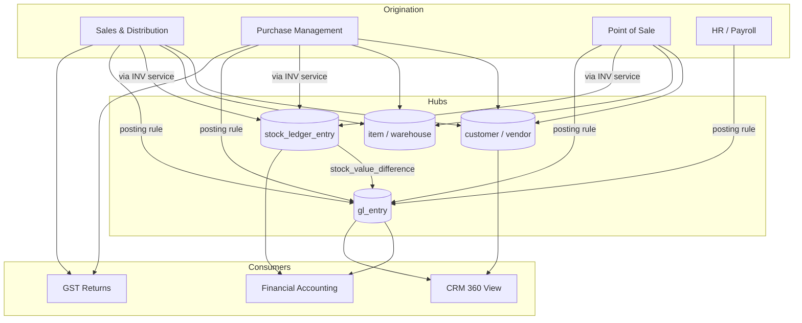
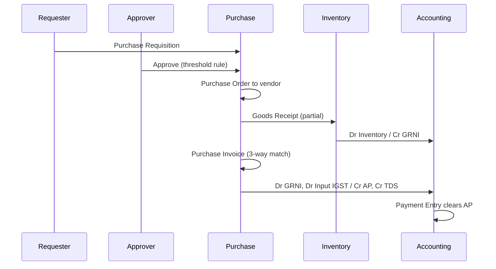

# 🧩 Niyanthra ERP — Functional Module & Data Architecture Specification

**Version:** 1.0
**Date:** September 2026
**Document Series:** Part 2 of 2 — companion to *Niyanthra ERP — Implementation Roadmap & Team Playbook (v1.0)*
**Purpose:** Definitive functional and data-level specification of the Niyanthra module set, their schema interconnections, and cross-module transaction lifecycles
**Audience:** Backend and frontend engineers (schema + API implementation), QA (test design), product and commercial stakeholders (soft-launch readiness)

---

## Table of Contents

1. [How to Read This Document](#1-how-to-read-this-document)
2. [Architectural Ground Rules](#2-architectural-ground-rules)
3. [Core Module Breakdown](#3-core-module-breakdown)
   - 3.1 [Sales & Distribution](#31-sales--distribution-sd)
   - 3.2 [Purchase Management](#32-purchase-management-pm)
   - 3.3 [Inventory & Stock Control](#33-inventory--stock-control-inv)
   - 3.4 [Financial Accounting](#34-financial-accounting-fi)
   - 3.5 [Point of Sale](#35-point-of-sale-pos)
   - 3.6 [CRM & HR](#36-crm--hr)
4. [Database Interconnections & Schema Relationships](#4-database-interconnections--schema-relationships)
5. [End-to-End Workflow Mapping](#5-end-to-end-workflow-mapping)
6. [Regional & Compliance Touchpoints](#6-regional--compliance-touchpoints)
7. [Appendix A: Document State Machines](#appendix-a-document-state-machines)
8. [Appendix B: API Surface by Module](#appendix-b-api-surface-by-module)
9. [Appendix C: Soft-Launch Readiness Matrix](#appendix-c-soft-launch-readiness-matrix)

---

## 1. How to Read This Document

Part 1 (the Playbook) answers *when* things ship and *who* ships them. This document answers *what exactly is being built* and *how the pieces are wired together*.

Three audiences, three reading paths:

| You are | Read | Skip |
|---|---|---|
| Backend engineer | §2, §4, §5, Appendix A/B | §3 business-value subsections |
| Frontend engineer | §3, §5, Appendix A (states drive UI affordances) | §4 DDL detail |
| QA | §5, §6, Appendix A | §3 |
| Stakeholder / commercial | §3, §6, Appendix C | §4, Appendix B |

### Scope notation used throughout

Every sub-feature is tagged with its delivery phase so that scope discipline (Playbook §Conclusion, success factor 1) is enforceable at the specification level, not just in sprint planning.

| Tag | Meaning |
|---|---|
| **P1** | In scope for Phase 1 go-live (Month 4, Week 4). Schema built, API built, UI built. |
| **P1-S** | Phase 1 **schema only**. Tables and foreign keys exist and are migrated; no UI. Prevents destructive migrations later. |
| **P2** | Phase 2 (Months 5–8). Referenced here so the schema is not designed into a corner. |
| **P3** | Phase 3 (Months 9–12). Directional only. |

> **Rule:** A P2/P3 feature may influence a column or a nullable FK in Phase 1. It may never influence an API contract or add a required field in Phase 1.

### Terminology

- **Company** — a tenant. One paying customer may own multiple companies (e.g. a group with two GSTINs). The `company_id` is the tenancy boundary, not the user account.
- **Document** — any transactional record with a lifecycle and a number (Sales Order, Invoice, GRN, Payment, Journal Entry).
- **Voucher** — a posted document that has produced GL entries. Every voucher is a document; not every document is a voucher.
- **Ledger** — one of the three append-only truth stores: `gl_entry` (value), `stock_ledger_entry` (quantity + valuation), `audit_log` (intent).

---

## 2. Architectural Ground Rules

These constrain every table and API in §3 and §4. They restate and make executable the decisions in the Playbook's Decision Log.

### 2.1 Tenancy model

Shared PostgreSQL database, shared schema, row-level isolation on `company_id`, enforced by PostgreSQL Row-Level Security (RLS) — not by application code alone.

```sql
-- Session context set by Django middleware immediately after authentication,
-- inside the same connection/transaction used for the request.
SET LOCAL app.company_id = '0f3c…';
SET LOCAL app.user_id    = '8ab1…';
```

Application connects as a non-superuser role with `NOBYPASSRLS`. This matters: a missing `.filter(company_id=…)` in a Django queryset becomes a returned-zero-rows bug instead of a cross-tenant data leak (Playbook risk register: *Multi-tenancy data leak → company dies*).

### 2.2 Database split

| Store | Contents | Tenancy |
|---|---|---|
| **Master DB** | Users, company registry, subscription/plan, module entitlements, country/state codes, HSN & SAC master, GST rate notifications, currency table, platform audit | Global, read-mostly |
| **Tenant data** | All transactional and master-data tables in §3 | `company_id`-scoped, RLS-enforced |
| **Redis** | Session, document-number locks, agent context cache, rate limiting | Namespaced by `company_id` |
| **pgvector** | Embeddings for RAG context (item descriptions, customer notes, past invoices) | `company_id` column on the embedding table, same RLS policy |

Statutory reference data (HSN, GST rates, state codes) lives in Master DB and is **read-only to tenants**. Rates are versioned with `effective_from` / `effective_to` so a mid-month notification change never rewrites history.

### 2.3 Key and type conventions

| Concern | Convention | Rationale |
|---|---|---|
| Primary key | `id UUID PRIMARY KEY DEFAULT gen_random_uuid()` | Safe to generate client-side/offline (POS, Flutter); no cross-tenant ID guessing |
| Tenant key | `company_id UUID NOT NULL` on every tenant table | Non-negotiable; RLS predicate |
| Human reference | `document_no TEXT NOT NULL` | Series-driven, `UNIQUE (company_id, document_no)` |
| Money | `NUMERIC(18,4)` stored, rounded to 2dp only at presentation and at GL posting | Avoids float drift in tax splits |
| Quantity | `NUMERIC(18,6)` | Supports kg/litre/metre trades |
| Rates/percent | `NUMERIC(9,4)` | 18.0000, 2.5000 |
| Timestamps | `TIMESTAMPTZ`, stored UTC, rendered in company timezone | `Asia/Kolkata` default |
| Dates of record | `DATE` (`posting_date`, `invoice_date`) never `TIMESTAMPTZ` | Statutory dates are calendar dates |
| Soft delete | **Not used on posted documents.** Cancel + reverse only | Audit integrity; GST documents cannot vanish |

### 2.4 The three invariants

Every engineer on this codebase should be able to recite these. They are the QA acceptance criteria in Playbook §QA Test Focus.

1. **GL balances.** For any `voucher_id`, `SUM(debit) = SUM(credit)`. Enforced by a deferred constraint trigger at transaction commit, not by application assertion.
2. **Stock reconciles.** For any `(company_id, item_id, warehouse_id)`, the `stock_balance` cache row equals the last `stock_ledger_entry.qty_after_transaction` for that key. A nightly Celery job asserts this and raises a Sentry event on drift.
3. **Subledger ties to GL.** `SUM(AR outstanding)` across `party_ledger` = balance of the Accounts Receivable control account in `gl_entry`. Same for AP. Nothing may post directly to a control account except through a subledger-aware voucher.

### 2.5 Document numbering

```sql
CREATE TABLE naming_series (
  id              UUID PRIMARY KEY DEFAULT gen_random_uuid(),
  company_id      UUID NOT NULL,
  document_type   TEXT NOT NULL,          -- 'SALES_INVOICE', 'PURCHASE_ORDER', …
  branch_id       UUID,                   -- optional per-branch series
  fiscal_year     TEXT NOT NULL,          -- '2026-27'
  prefix          TEXT NOT NULL,          -- 'INV/2026-27/'
  current_value   BIGINT NOT NULL DEFAULT 0,
  width           SMALLINT NOT NULL DEFAULT 5,
  UNIQUE (company_id, document_type, branch_id, fiscal_year)
);
```

Numbers are allocated with `SELECT … FOR UPDATE` on the series row inside the document's own transaction. Consequence: **an abandoned draft does not burn a number**, and the sequence is gapless — a GST audit requirement that a plain PostgreSQL `SEQUENCE` cannot satisfy, since sequences are non-transactional.

---

## 3. Core Module Breakdown

### 3.1 Sales & Distribution (SD)

#### Functional scope

Everything from a priced offer to a compliant tax invoice and its dispatch paperwork. SD owns the customer-facing document chain; it *requests* stock from INV and *hands off* value to FI, but owns neither.

#### Sub-features

| # | Sub-feature | Phase | Notes |
|---|---|---|---|
| SD-01 | Customer master (billing + multiple shipping addresses, GSTIN, credit terms) | **P1** | GSTIN validated for checksum + state code consistency |
| SD-02 | Quotation / Proforma with validity date and revision tracking | **P1** | Revisions create new version rows, not edits |
| SD-03 | Sales Order with line-level delivery dates | **P1** | Partial fulfilment supported |
| SD-04 | Stock availability check + soft reservation at SO confirmation | **P1** | Calls INV; see §5.1 |
| SD-05 | Delivery Note / Dispatch (goods movement, may precede invoice) | **P1** | This is the COGS-triggering document |
| SD-06 | Tax Invoice generation with full GST computation | **P1** | Core; blocker item in Playbook |
| SD-07 | Credit Note / Sales Return with original-invoice linkage | **P1** | GSTR-1 Table 9B depends on this |
| SD-08 | Price lists + customer-specific pricing + quantity slabs | **P1** | Rate resolution order documented below |
| SD-09 | Discount handling (line %, line amount, document-level apportioned) | **P1** | Document-level discount apportioned to lines *before* tax |
| SD-10 | Credit limit check + block/warn at SO and Invoice | **P1** | Reads AR outstanding from FI |
| SD-11 | Invoice PDF, email delivery, WhatsApp share link | **P1** | Celery async |
| SD-12 | e-Invoice IRN + signed QR (NSDL/IRP) | **P1** | See §6.4 |
| SD-13 | e-Way Bill readiness: Part-A payload assembled and stored at invoice post | **P1-S** | Payload generated & persisted; **submission to NIC is P2** |
| SD-14 | Delivery challan (non-sale movement: job work, approval, branch transfer) | **P2** | |
| SD-15 | Sales commission, target vs achievement | **P2** | |
| SD-16 | Route/beat plan, van sales | **P3** | Distribution-heavy verticals |

> **On SD-13 ("E-way bill readiness"):** the Phase 1 commitment is that at the moment a qualifying invoice is posted, Niyanthra persists a complete, schema-valid `eway_bill_request` row containing transporter, distance, vehicle, and consignment data. The customer can copy/upload it to the NIC portal on day one. API submission and Part-B updates land in Phase 2 (Playbook Month 7–8). This is deliberately staged so that go-live is not gated on a second government API integration in the same quarter as IRP.

#### Rate resolution order (authoritative)

When a line item's rate is derived, the engine resolves in this order and stops at the first hit — this must be identical in the API, the agent, and the POS client:

1. Manually overridden rate on the line (flagged `rate_overridden = true`, requires permission `sd.override_rate`)
2. Customer-specific contract price valid on `posting_date`
3. Price list attached to the customer, quantity-slab matched
4. Price list attached to the customer, base row
5. Company default price list
6. `item.standard_selling_rate`

#### Business value

- Cuts quote-to-invoice re-keying to zero; the Playbook's <2s invoice creation target is met because tax and rate resolution are server-side single-round-trip.
- Credit-limit enforcement at order entry is the single highest-ROI control for the SMB trading segment — it converts an after-the-fact receivables problem into a point-of-decision block.
- e-Invoice and e-way bill readiness remove the customer's dependence on a separate compliance utility, which is the main reason Tally-adjacent SMBs run two systems.

#### Primary tables

`customer`, `customer_address`, `price_list`, `price_list_item`, `quotation` / `quotation_item`, `sales_order` / `sales_order_item`, `delivery_note` / `delivery_note_item`, `sales_invoice` / `sales_invoice_item`, `sales_tax_line`, `credit_note` / `credit_note_item`, `einvoice_request`, `eway_bill_request`.

---

### 3.2 Purchase Management (PM)

#### Functional scope

The mirror of SD on the supply side, with one structural difference that engineers must internalise: **on the purchase side, the goods and the invoice frequently arrive on different days and in different quantities.** The schema therefore treats Goods Receipt and Purchase Invoice as independent documents reconciled through a clearing account (GRNI), never as a single event.

#### Sub-features

| # | Sub-feature | Phase | Notes |
|---|---|---|---|
| PM-01 | Vendor master (GSTIN, MSME/Udyam status, payment terms, TDS section default) | **P1** | MSME flag drives 45-day payment alerting |
| PM-02 | Purchase Requisition (internal, multi-department) | **P1** | Can be auto-raised by the reorder agent |
| PM-03 | Requisition approval workflow (threshold-based) | **P1** | Uses the 5-layer permission model |
| PM-04 | Request for Quotation → Vendor Quotation → comparison grid | **P2** | |
| PM-05 | Purchase Order with delivery schedule | **P1** | |
| PM-06 | Goods Receipt Note (GRN) with accept / reject / short-receipt | **P1** | Creates stock; posts to GRNI |
| PM-07 | Quality inspection hold (received-but-not-available warehouse) | **P1-S** | Warehouse type `QUARANTINE` exists in P1 |
| PM-08 | Purchase Invoice (with or without PO, with or without GRN) | **P1** | Three-way match tolerance configurable |
| PM-09 | Landed cost allocation (freight, insurance, customs → item valuation) | **P2** | Schema carries `landed_cost_voucher_id` nullable from P1 |
| PM-10 | Debit Note / Purchase Return | **P1** | |
| PM-11 | Vendor advance / prepayment with adjustment against invoice | **P1** | GST on advances: see §6.7 |
| PM-12 | Reverse Charge Mechanism (RCM) identification and self-invoicing | **P1** | Statutory; cannot be deferred |
| PM-13 | Import purchases (BoE, customs duty, IGST on imports) | **P3** | |

#### Three-way match

```
PO quantity & rate  ⟷  GRN accepted quantity  ⟷  Purchase Invoice quantity & rate
```

Tolerances are per-company configuration rows, not constants:

| Check | Default tolerance | Behaviour on breach |
|---|---|---|
| GRN qty vs PO qty | +0% / −100% | Over-receipt blocked; short receipt allowed, PO stays open |
| Invoice qty vs GRN qty | 0% | Block |
| Invoice rate vs PO rate | ±2% or ₹100, whichever lower | Warn → requires `pm.approve_price_variance` |

#### Business value

- The GRNI clearing account makes "goods received but not billed" a *number on the balance sheet* rather than a pile of paper on someone's desk. For distributors carrying 40–60 day supplier cycles this is the difference between a real month-end close and an estimate.
- MSME/Udyam flagging on the vendor master gives early warning on the 45-day payment rule, which carries a tax-deductibility consequence for the buyer.
- Requisition → PO approval thresholds are the first genuine internal control most of our target customers will have ever had.

#### Primary tables

`vendor`, `vendor_address`, `purchase_requisition` / `_item`, `purchase_order` / `_item`, `goods_receipt` / `_item`, `purchase_invoice` / `_item`, `purchase_tax_line`, `debit_note` / `_item`, `three_way_match_exception`.

---

### 3.3 Inventory & Stock Control (INV)

#### Functional scope

INV owns the single source of truth for *how much is where, and what it cost*. No other module may write a stock quantity. SD, PM and POS all mutate stock exclusively by emitting `stock_ledger_entry` rows through the INV service layer.

#### Sub-features

| # | Sub-feature | Phase | Notes |
|---|---|---|---|
| INV-01 | Item master: UoM, UoM conversions, item group, HSN/SAC, tax class | **P1** | HSN is mandatory for goods |
| INV-02 | Multi-warehouse, hierarchical (Company → Branch → Warehouse → Bin) | **P1** | Bin level is P1-S |
| INV-03 | Warehouse types: `STORE`, `QUARANTINE`, `TRANSIT`, `SCRAP`, `POS_COUNTER` | **P1** | Transit is what makes transfers safe |
| INV-04 | Perpetual stock ledger (append-only, immutable) | **P1** | The spine of the module |
| INV-05 | Valuation: Moving Average (default), FIFO | **P1** | Method locked per item at creation; changing it requires a revaluation voucher |
| INV-06 | Batch tracking with manufacture/expiry dates | **P1** | FEFO picking suggestion |
| INV-07 | Serial number tracking | **P1-S** | Schema present; UI in P2 |
| INV-08 | Stock transfer between warehouses (single-step and two-step via TRANSIT) | **P1** | |
| INV-09 | Stock reservation against confirmed Sales Orders | **P1** | Soft allocation; see §4.5 |
| INV-10 | Reorder level, reorder quantity, lead-time-aware alerts | **P1** | Feeds the Suggestion Agent |
| INV-11 | Physical stock take / cycle count with variance posting | **P1** | Variance hits Stock Adjustment expense |
| INV-12 | Stock ageing and slow-moving analysis | **P2** | |
| INV-13 | Bill of Materials, production orders | **P3** | Playbook Month 9–12 |

#### The stock ledger contract

`stock_ledger_entry` (SLE) is append-only. It is never updated and never deleted. A cancellation produces an equal-and-opposite SLE with `is_cancellation = true` and a pointer to the original.

Every SLE carries the *resulting* state, not just the delta:

| Column | Meaning |
|---|---|
| `actual_qty` | Signed delta (+ receipt, − issue) |
| `qty_after_transaction` | Running balance for `(item, warehouse, batch)` after this entry |
| `incoming_rate` | Rate at which stock entered (receipts only) |
| `valuation_rate` | Resulting moving-average or FIFO rate after this entry |
| `stock_value` | `qty_after_transaction × valuation_rate` |
| `stock_value_difference` | **The exact amount posted to the Inventory GL account by this entry** |

`stock_value_difference` is the contract between INV and FI. FI never recomputes inventory value; it consumes this number. This is what makes invariant #3 hold under back-dated entries.

#### Back-dated entries

Back-dated stock movements are permitted (they are a fact of SMB life) but they are expensive: inserting an SLE with a `posting_date` earlier than existing entries triggers an asynchronous **repost** of `qty_after_transaction`, `valuation_rate` and `stock_value_difference` for all later entries of that `(item, warehouse)` key, plus regeneration of the affected GL entries.

- Reposts run on a dedicated Celery queue with a per-`(company_id, item_id, warehouse_id)` advisory lock.
- Reposts are blocked entirely for periods closed under `period_closing_voucher` (§3.4).
- A repost in flight sets `repost_in_progress = true` on the affected `stock_balance` rows; valuation-sensitive reads (COGS posting, stock valuation report) wait on it.

#### Business value

Stock accuracy is the number one reason SMB ERP rollouts fail. Making the ledger immutable, making valuation a stored consequence rather than a recomputed opinion, and making COGS derive from the same number the stock report shows means a customer's accountant and storekeeper cannot disagree — which is exactly the argument that closes these deals.

#### Primary tables

`item`, `item_uom_conversion`, `item_tax_class`, `warehouse`, `bin`, `batch`, `serial_no`, `stock_ledger_entry`, `stock_balance`, `stock_reservation`, `stock_entry` / `_item` (transfers & adjustments), `stock_reconciliation` / `_item`, `repost_queue`.

---

### 3.4 Financial Accounting (FI)

#### Functional scope

FI is a **consumer**, not an originator, of most transactions. Its design principle: *no human types a journal entry that the system could have derived.* Manual journals exist, but every routine posting in §5 is generated by a posting rule, not by a user.

#### Sub-features

| # | Sub-feature | Phase | Notes |
|---|---|---|---|
| FI-01 | Chart of Accounts, hierarchical, India-preset template on company creation | **P1** | Preset ships with statutory GST accounts pre-created |
| FI-02 | Fiscal year, accounting periods, period open/close | **P1** | India default 1 Apr – 31 Mar |
| FI-03 | Double-entry General Ledger (`gl_entry`, append-only) | **P1** | Invariant #1 |
| FI-04 | Automatic posting rules per document type | **P1** | See §4.6 |
| FI-05 | Manual Journal Entry with attachment + approval | **P1** | Blocked on control accounts |
| FI-06 | Party subledger: AR / AP with per-invoice outstanding | **P1** | Invariant #3 |
| FI-07 | Payment Entry: receipt, payment, internal transfer | **P1** | Manual recording in P1 per Decision Log |
| FI-08 | Payment allocation against multiple invoices, partial allocation, on-account | **P1** | |
| FI-09 | AR / AP ageing (0–30/31–60/61–90/90+, buckets configurable) | **P1** | |
| FI-10 | Bank accounts + bank reconciliation (manual matching) | **P1** | Auto-matching agent is P2 |
| FI-11 | Bank statement import (CSV / Excel / MT940) | **P1** | |
| FI-12 | Trial Balance, P&L, Balance Sheet, Cash Flow (indirect) | **P1** | Cash Flow is P2 |
| FI-13 | Cost centres / dimensions on every GL line | **P1-S** | Column present, UI in P2 |
| FI-14 | Automated GST output/input tax postings | **P1** | §6 |
| FI-15 | TDS on purchases (deduction, payable tracking, section-wise) | **P1** | Certificate generation is P2 |
| FI-16 | TCS on sales u/s 206C(1H) | **P1-S** | Threshold engine schema present |
| FI-17 | Period closing voucher (P&L → Retained Earnings) | **P1** | |
| FI-18 | Opening balance import for migrating customers | **P1** | Critical for onboarding; see note |
| FI-19 | Multi-currency with revaluation | **P3** | Deferred per Playbook |
| FI-20 | Fixed assets & depreciation schedules | **P3** | |

> **FI-18 is an under-estimated blocker.** Every one of the three launch customers arrives mid-year with existing balances. Opening balance import must handle: trial balance opening, open AR invoices (per-invoice, not net), open AP invoices, and opening stock with valuation rates. Without per-invoice AR opening, the ageing report is wrong on day one and the customer loses confidence in week one. Recommend this be promoted to the Critical Path table in Playbook §Critical Path Items.

#### GL entry structure

```sql
CREATE TABLE gl_entry (
  id                 UUID PRIMARY KEY DEFAULT gen_random_uuid(),
  company_id         UUID        NOT NULL,
  posting_date       DATE        NOT NULL,
  fiscal_year        TEXT        NOT NULL,
  account_id         UUID        NOT NULL,
  debit              NUMERIC(18,2) NOT NULL DEFAULT 0,
  credit             NUMERIC(18,2) NOT NULL DEFAULT 0,
  -- polymorphic source document
  voucher_type       TEXT        NOT NULL,   -- 'SALES_INVOICE' | 'PAYMENT_ENTRY' | …
  voucher_id         UUID        NOT NULL,
  voucher_no         TEXT        NOT NULL,   -- denormalised for reporting speed
  -- subledger keys (exactly one of these is set when account is a control account)
  party_type         TEXT,                   -- 'CUSTOMER' | 'VENDOR' | 'EMPLOYEE'
  party_id           UUID,
  against_voucher_type TEXT,                 -- for payment allocation
  against_voucher_id   UUID,
  -- dimensions
  cost_center_id     UUID,
  branch_id          UUID,
  project_id         UUID,
  -- state
  is_cancelled       BOOLEAN NOT NULL DEFAULT false,
  remarks            TEXT,
  created_at         TIMESTAMPTZ NOT NULL DEFAULT now(),
  created_by         UUID NOT NULL,

  CONSTRAINT gl_one_sided CHECK (
    (debit  > 0 AND credit = 0) OR
    (credit > 0 AND debit  = 0) OR
    (debit  = 0 AND credit = 0)
  )
);

CREATE INDEX ix_gl_company_posting  ON gl_entry (company_id, posting_date);
CREATE INDEX ix_gl_company_account  ON gl_entry (company_id, account_id, posting_date);
CREATE INDEX ix_gl_voucher          ON gl_entry (company_id, voucher_type, voucher_id);
CREATE INDEX ix_gl_party            ON gl_entry (company_id, party_type, party_id, posting_date)
  WHERE party_id IS NOT NULL;
```

The balancing invariant is enforced as a deferred constraint trigger:

```sql
CREATE CONSTRAINT TRIGGER trg_gl_balanced
  AFTER INSERT ON gl_entry
  DEFERRABLE INITIALLY DEFERRED
  FOR EACH ROW EXECUTE FUNCTION assert_voucher_balanced();
-- assert_voucher_balanced() compares SUM(debit) vs SUM(credit)
-- for NEW.voucher_id, rounded to 2dp, and raises on mismatch.
```

#### Business value

The commercial pitch is "your books are closed the moment your last invoice is entered." That claim is only defensible because posting is derived and the three invariants are machine-checked. For stakeholders: this is what allows a single accountant to service 3× the clients, which is the channel-partner economics that drives adoption.

#### Primary tables

`account`, `fiscal_year`, `accounting_period`, `gl_entry`, `journal_entry` / `_line`, `payment_entry` / `_allocation`, `party_ledger_summary` (materialised), `bank_account`, `bank_transaction`, `bank_reconciliation` / `_match`, `tds_entry`, `period_closing_voucher`, `opening_balance_batch`.

---

### 3.5 Point of Sale (POS)

#### Functional scope

A latency-first, keyboard-and-scanner-first billing surface for counter retail and for hybrid businesses (a wholesaler with a front counter). POS is **not a separate ledger.** A POS bill is a `sales_invoice` row with `is_pos = true`. It flows into exactly the same stock ledger, GL, and GSTR-1 as a regular tax invoice. This is the most important design decision in the module: there is no reconciliation between "POS sales" and "accounting sales", because there is only one set of books.

#### Sub-features

| # | Sub-feature | Phase | Notes |
|---|---|---|---|
| POS-01 | POS profile per counter (warehouse, price list, payment modes, default customer) | **P1** | |
| POS-02 | Barcode / QR scan to line, scan-to-increment quantity | **P1** | |
| POS-03 | Keyboard-only checkout path (no mouse required) | **P1** | F-key bindings; a real adoption factor |
| POS-04 | Fast item search (code, name, alias) with sub-100ms local index | **P1** | Client-side index of active items |
| POS-05 | Walk-in / unregistered customer default, upgrade-to-customer on demand | **P1** | B2C vs B2B invoice treatment differs — §6.3 |
| POS-06 | Split tender (cash + card + UPI) on a single bill | **P1** | |
| POS-07 | Cash rounding to nearest rupee with `Round Off` GL account | **P1** | |
| POS-08 | Shift / session open & close with cash denomination count and variance | **P1** | `pos_session` |
| POS-09 | Hold / recall bill (parked sales) | **P1** | |
| POS-10 | POS return / exchange against original bill | **P1** | Produces a Credit Note |
| POS-11 | Thermal receipt (58/80mm) + optional A4 tax invoice | **P1** | |
| POS-12 | Offline mode with local queue and idempotent sync | **P2** | Flutter; deferred with mobile per Decision Log |
| POS-13 | Loyalty points, gift vouchers | **P2** | |
| POS-14 | Integrated payment terminal / UPI dynamic QR | **P2** | |

#### Performance design

The <2s invoice target in the Playbook is a *back office* target. POS needs a ~300ms target, so the POS checkout API deviates from the standard invoice API in three ways:

1. **Pre-resolved pricing.** The POS profile ships the client a pre-computed price + tax-class snapshot at session open. The server still recomputes authoritatively, but the client renders instantly.
2. **Deferred artefacts.** PDF, e-invoice IRN request, and the `stock_balance` cache refresh are dispatched to Celery *after* commit. The synchronous path writes: `sales_invoice`, `sales_invoice_item`, `sales_tax_line`, `stock_ledger_entry`, `gl_entry`, `payment_entry`. Nothing else.
3. **Idempotency key.** Every checkout carries a client-generated `idempotency_key UUID`, unique per `(company_id, key)`. A retried request returns the original invoice instead of creating a duplicate — a hard requirement given counter Wi-Fi, and the foundation for POS-12 offline sync.

#### Session and cash control

`pos_session` ties every POS invoice to an operator and a shift. At close, the system compares expected cash (opening float + cash tenders − cash refunds − pay-outs) against counted denominations and posts any variance to `Cash Short/Over`. Without this, POS cash is untraceable and the module has negative value to an owner.

#### Business value

Hybrid retail-plus-wholesale is a large share of the Kerala/South-India SMB base we are targeting. Today these businesses run a billing utility at the counter and Tally in the back office, and reconcile monthly by hand. Collapsing those into one ledger is a concrete, demonstrable hour-count saving in the sales demo.

#### Primary tables

`pos_profile`, `pos_session`, `pos_payment_mode`, `sales_invoice` (`is_pos`, `pos_session_id`), `pos_held_bill`, `payment_entry`.

---

### 3.6 CRM & HR

Two lightweight modules bundled here because both are *deliberately shallow* in Phase 1. Their job is to remove the customer's need for a second system for basic tracking — not to compete with Salesforce or Darwinbox.

#### 3.6.1 CRM

| # | Sub-feature | Phase | Notes |
|---|---|---|---|
| CRM-01 | Lead capture (manual, CSV import, web-form endpoint) | **P1** | |
| CRM-02 | Lead lifecycle: New → Contacted → Qualified → Converted / Lost, with lost-reason | **P1** | |
| CRM-03 | Activity log: call, meeting, note, next-action date | **P1** | |
| CRM-04 | Lead → Customer conversion (creates `customer`, links history) | **P1** | `customer.converted_from_lead_id` |
| CRM-05 | 360° customer history: quotations, orders, invoices, payments, outstanding, returns | **P1** | Read model across SD + FI |
| CRM-06 | Opportunity / deal value and pipeline stage | **P2** | |
| CRM-07 | Segmentation & repeat-purchase analysis | **P2** | Playbook Month 5–6 |
| CRM-08 | Campaigns, email/WhatsApp sequences | **P3** | |

The **360° customer view (CRM-05) is the sleeper feature.** It is nearly free to build — it is a read model over tables SD and FI already own — and it is the single screen that makes a business owner feel the system is "one system". Prioritise its UI polish above CRM-01–04.

#### 3.6.2 HR & Payroll

| # | Sub-feature | Phase | Notes |
|---|---|---|---|
| HR-01 | Employee directory (personal, contact, reporting manager, department, designation) | **P1** | |
| HR-02 | Employment lifecycle: joining date, confirmation, exit date, status | **P1** | |
| HR-03 | Statutory identifiers: PAN, Aadhaar (masked at rest), UAN, ESIC number, bank details | **P1** | Encrypted columns; see note |
| HR-04 | Salary structure: earning & deduction components, formula-based | **P1** | Components are rows, not code |
| HR-05 | Attendance / leave register (basic: present, absent, leave, holiday) | **P1** | Biometric integration is P2 |
| HR-06 | Monthly payroll run → payslips | **P1** | |
| HR-07 | Statutory computation: PF, ESI, Professional Tax, TDS on salary | **P1** | §6.8 |
| HR-08 | Payroll → GL posting (salary expense, statutory payables, net payable) | **P1** | |
| HR-09 | Payslip PDF + email | **P1** | |
| HR-10 | Bank salary transfer file export | **P1-S** | Format per bank; P2 |
| HR-11 | Form 16 / Form 24Q generation | **P2** | |
| HR-12 | Leave balance accrual, encashment, appraisals, self-service portal | **P3** | Playbook Month 9–12 |

> **Data protection note.** HR-03 stores identity documents. These columns are encrypted at rest with a per-company data key (envelope encryption, key in KMS), are excluded from the RAG/pgvector pipeline by an explicit column deny-list, and are never included in agent context. Aadhaar is stored masked (last 4 digits) unless a documented statutory need is established. This should be added to Playbook §Technical Debt & Risk Mitigation as a named risk, because the agent layer creates a realistic path for PII to leak into a third-party LLM prompt.

> **Scope realism.** The Playbook correctly lists payroll as "nice-to-have, not critical for traders/wholesale". The recommendation here is: ship HR-01 → HR-03 (directory) in Phase 1 as declared, and ship HR-04 → HR-09 (payroll) **only if** a launch customer names it as a blocker. Payroll statutory rules carry per-state variation (Professional Tax alone differs across Kerala, Karnataka, Maharashtra, Tamil Nadu) and the testing surface is disproportionate to Phase 1 value.

#### Primary tables

`lead`, `lead_activity`, `customer` (shared with SD), `employee`, `employee_statutory`, `department`, `designation`, `salary_component`, `salary_structure` / `_assignment`, `attendance`, `leave_application`, `payroll_run`, `salary_slip` / `_detail`.

---

## 4. Database Interconnections & Schema Relationships

### 4.1 The hub-and-spoke picture

Niyanthra has six functional modules but only **four hubs**. Every module is wired to the hubs; modules are only weakly wired to each other. This is what keeps the dependency graph acyclic and makes a module independently testable.

| Hub | Table | Who writes | Who reads |
|---|---|---|---|
| **Party hub** | `customer`, `vendor` | SD, PM, CRM | Everyone |
| **Item hub** | `item` | INV | SD, PM, POS |
| **Quantity ledger** | `stock_ledger_entry` | INV service layer *only* | SD, PM, POS, FI |
| **Value ledger** | `gl_entry` | FI posting engine *only* | Everyone |



**Read the arrows literally.** There is no arrow from SD to `gl_entry` drawn by SD code — SD emits a domain event, the FI posting engine resolves a posting rule and writes the GL. A `from accounting.models import GLEntry` inside the `sales` app is a code-review rejection.

### 4.2 Tenant-safe referential integrity — the composite FK pattern

A plain `FOREIGN KEY (customer_id) REFERENCES customer(id)` is **insufficient** in a shared-schema multi-tenant database. It guarantees the customer exists; it does not guarantee the customer belongs to the same company as the invoice. A bug in a service layer that resolves a customer from an unfiltered queryset produces a structurally valid but cross-tenant row, which RLS will then *hide* — creating an invoice whose customer is invisible to its own owner.

The fix is to make `company_id` part of every foreign key.

```sql
-- 1. Every parent exposes a tenant-qualified unique key.
ALTER TABLE customer
  ADD CONSTRAINT uq_customer_company UNIQUE (company_id, id);

ALTER TABLE item
  ADD CONSTRAINT uq_item_company     UNIQUE (company_id, id);

ALTER TABLE warehouse
  ADD CONSTRAINT uq_warehouse_company UNIQUE (company_id, id);

-- 2. Every child references the parent *through* company_id.
CREATE TABLE sales_invoice (
  id           UUID NOT NULL DEFAULT gen_random_uuid(),
  company_id   UUID NOT NULL,
  customer_id  UUID NOT NULL,
  sales_order_id UUID,
  posting_date DATE NOT NULL,
  ...
  PRIMARY KEY (id),
  CONSTRAINT uq_sales_invoice_company UNIQUE (company_id, id),
  CONSTRAINT fk_si_customer
    FOREIGN KEY (company_id, customer_id)
    REFERENCES customer (company_id, id),
  CONSTRAINT fk_si_sales_order
    FOREIGN KEY (company_id, sales_order_id)
    REFERENCES sales_order (company_id, id)
);
```

Now a cross-tenant reference is impossible at the storage layer. The database rejects it whether the bug is in Django, in a raw SQL report, in a data-migration script, or in an agent-generated query. This is the control that converts the Playbook's "code review all tenant_id filters" mitigation from a process hope into a structural guarantee.

In Django this is expressed with a `ForeignObject` or, more pragmatically, with a normal `ForeignKey` plus the composite constraint added in a `RunSQL` migration and a shared `TenantModel` base class that stamps `company_id` on save. Either way, **the constraint must exist in the database**, not only in the ORM.

#### RLS policy applied uniformly

```sql
ALTER TABLE sales_invoice ENABLE ROW LEVEL SECURITY;
ALTER TABLE sales_invoice FORCE ROW LEVEL SECURITY;

CREATE POLICY tenant_isolation ON sales_invoice
  USING       (company_id = current_setting('app.company_id')::uuid)
  WITH CHECK  (company_id = current_setting('app.company_id')::uuid);
```

`WITH CHECK` is as important as `USING`: without it, a tenant could *write* a row stamped with another company's id even though it could not read it back.

Three operational rules follow:

1. **Migration generator.** A management command asserts that every table carrying a `company_id` column has RLS enabled, forced, and a policy present. It runs in CI and fails the build. New tables cannot be forgotten.
2. **Connection roles.** Web/Celery workers use `niyanthra_app` (`NOBYPASSRLS`). Migrations and the repost worker use `niyanthra_migrate`, which bypasses RLS and is never exposed to request-handling code.
3. **Missing context fails closed.** `current_setting('app.company_id')` with no value raises rather than returning NULL, so an un-scoped connection errors instead of silently matching nothing.

### 4.3 Document linkage: how the chain is traced

Every downstream document stores a **direct FK to its immediate predecessor at the line level**, not only at the header. Header-only links break as soon as a Sales Order is partially delivered across two Delivery Notes and then invoiced across three invoices — which is the normal case in distribution.

```
sales_order_item.id
   ↖ delivery_note_item.sales_order_item_id
        ↖ sales_invoice_item.delivery_note_item_id
   ↖ sales_invoice_item.sales_order_item_id   (direct-invoice path, no DN)
```

Each line carries the progress counters that drive the parent's status:

| Table | Columns |
|---|---|
| `sales_order_item` | `qty`, `delivered_qty`, `invoiced_qty`, `reserved_qty` |
| `purchase_order_item` | `qty`, `received_qty`, `billed_qty` |
| `goods_receipt_item` | `accepted_qty`, `rejected_qty`, `billed_qty` |

Status on the header is **derived, never typed**: a Sales Order is `COMPLETED` when every line has `delivered_qty >= qty AND invoiced_qty >= qty` (or is explicitly short-closed). Storing status as an independently-writable field is the most common source of "the order says open but there's nothing left to ship" support tickets.

For reporting and for the agent's RAG context, a thin generic index makes the whole chain traversable in one query:

```sql
CREATE TABLE document_link (
  id                UUID PRIMARY KEY DEFAULT gen_random_uuid(),
  company_id        UUID NOT NULL,
  source_type       TEXT NOT NULL,
  source_id         UUID NOT NULL,
  target_type       TEXT NOT NULL,
  target_id         UUID NOT NULL,
  link_type         TEXT NOT NULL,   -- 'FULFILS' | 'BILLS' | 'REVERSES' | 'SETTLES'
  created_at        TIMESTAMPTZ NOT NULL DEFAULT now(),
  UNIQUE (company_id, source_type, source_id, target_type, target_id, link_type)
);
CREATE INDEX ix_doclink_source ON document_link (company_id, source_type, source_id);
CREATE INDEX ix_doclink_target ON document_link (company_id, target_type, target_id);
```

`document_link` is a **derived index, not the source of truth.** The typed line-level FKs remain authoritative; `document_link` is written in the same transaction and can be rebuilt from the FKs at any time.

### 4.4 Module-to-module foreign key map

| From (child) | Column | To (parent) | Module boundary crossed | On delete |
|---|---|---|---|---|
| `sales_order.customer_id` | | `customer` | SD → SD | RESTRICT |
| `sales_order_item.item_id` | | `item` | SD → **INV** | RESTRICT |
| `sales_order_item.warehouse_id` | | `warehouse` | SD → **INV** | RESTRICT |
| `stock_reservation.sales_order_item_id` | | `sales_order_item` | **INV** → SD | CASCADE |
| `delivery_note_item.sales_order_item_id` | | `sales_order_item` | SD → SD | RESTRICT |
| `stock_ledger_entry.voucher_id` | polymorphic | DN / SI / GRN / SE | **INV** ← all | — (never deleted) |
| `sales_invoice_item.delivery_note_item_id` | | `delivery_note_item` | SD → SD | RESTRICT |
| `sales_invoice.pos_session_id` | | `pos_session` | SD ← **POS** | RESTRICT |
| `sales_tax_line.tax_rate_id` | | `tax_rate` (Master) | SD → **Master** | RESTRICT |
| `gl_entry.voucher_id` | polymorphic | any posted document | **FI** ← all | — (never deleted) |
| `gl_entry.party_id` | | `customer` / `vendor` | **FI** → SD/PM | RESTRICT |
| `gl_entry.against_voucher_id` | | `sales_invoice` / `purchase_invoice` | **FI** → SD/PM | RESTRICT |
| `payment_entry_allocation.reference_id` | polymorphic | SI / PI / JE | **FI** → SD/PM | RESTRICT |
| `purchase_requisition_item.item_id` | | `item` | PM → **INV** | RESTRICT |
| `purchase_order_item.requisition_item_id` | | `purchase_requisition_item` | PM → PM | SET NULL |
| `goods_receipt_item.purchase_order_item_id` | | `purchase_order_item` | PM → PM | RESTRICT |
| `purchase_invoice_item.goods_receipt_item_id` | | `goods_receipt_item` | PM → PM | RESTRICT |
| `batch.item_id` | | `item` | INV → INV | RESTRICT |
| `stock_ledger_entry.batch_id` | | `batch` | INV → INV | RESTRICT |
| `customer.converted_from_lead_id` | | `lead` | SD ← **CRM** | SET NULL |
| `salary_slip.employee_id` | | `employee` | HR → HR | RESTRICT |
| `gl_entry.party_id` (`party_type='EMPLOYEE'`) | | `employee` | **FI** → HR | RESTRICT |
| `einvoice_request.sales_invoice_id` | | `sales_invoice` | Compliance → SD | RESTRICT |
| `eway_bill_request.source_document_id` | polymorphic | SI / DN | Compliance → SD | RESTRICT |

**On polymorphic references.** `stock_ledger_entry`, `gl_entry`, `document_link`, `payment_entry_allocation` and `eway_bill_request` use `(voucher_type, voucher_id)` pairs because they must reference a dozen document types. These cannot carry a declarative FK. The compensating controls are:

- `voucher_type` is constrained to an enum-backed lookup table, not free text.
- Referenced documents are **never hard-deleted**, so there is no dangling-pointer scenario — cancellation writes reversal rows.
- A nightly integrity job resolves a sample of polymorphic pointers and alerts on any orphan.

### 4.5 Stock reservation model

Reservation is the seam between SD and INV and is the most subtle piece of the schema. Design: **soft reservation against confirmed Sales Orders, consumed at delivery.**

```sql
CREATE TABLE stock_reservation (
  id                  UUID PRIMARY KEY DEFAULT gen_random_uuid(),
  company_id          UUID NOT NULL,
  item_id             UUID NOT NULL,
  warehouse_id        UUID NOT NULL,
  batch_id            UUID,
  sales_order_id      UUID NOT NULL,
  sales_order_item_id UUID NOT NULL,
  reserved_qty        NUMERIC(18,6) NOT NULL CHECK (reserved_qty > 0),
  delivered_qty       NUMERIC(18,6) NOT NULL DEFAULT 0,
  status              TEXT NOT NULL DEFAULT 'ACTIVE',  -- ACTIVE | CONSUMED | RELEASED
  expires_at          TIMESTAMPTZ,
  created_at          TIMESTAMPTZ NOT NULL DEFAULT now(),
  CONSTRAINT fk_res_soi FOREIGN KEY (company_id, sales_order_item_id)
    REFERENCES sales_order_item (company_id, id) ON DELETE CASCADE
);
CREATE INDEX ix_reservation_stockkey
  ON stock_reservation (company_id, item_id, warehouse_id)
  WHERE status = 'ACTIVE';
```

And the availability definition every module must use — no module may compute this differently:

```
available_for_sale = stock_balance.actual_qty
                   − Σ(active reservations for item+warehouse)
                   − stock_balance.qty_in_quarantine
```

Rules:

- Reservation is created at SO **confirmation**, not at draft. Drafts never lock stock.
- Reservation does **not** create a `stock_ledger_entry`. Reserved goods are still physically present and still on the balance sheet at full value. Only the Delivery Note moves stock.
- `expires_at` (default: SO delivery date + configurable grace) lets a Celery sweeper release stale reservations so that a forgotten order does not starve the counter.
- POS **bypasses reservation** entirely — it is a simultaneous sale-and-delivery, so it goes straight to an SLE issue. A POS sale can therefore legitimately fail on stock that a back-office SO has reserved; the POS profile setting `allow_negative_on_reserved` decides whether to block or warn.
- Reservation rows are advisory-locked per `(item_id, warehouse_id)` during the check-and-create step to prevent two concurrent orders over-committing the same unit.

### 4.6 The posting rule registry — how documents become GL entries

Rather than scattering `create_gl_entry()` calls across six Django apps, posting is table-driven and centralised.

```sql
CREATE TABLE posting_rule (
  id              UUID PRIMARY KEY DEFAULT gen_random_uuid(),
  company_id      UUID,                 -- NULL = platform default template
  voucher_type    TEXT NOT NULL,        -- 'SALES_INVOICE'
  sequence        SMALLINT NOT NULL,
  leg             TEXT NOT NULL,        -- 'DEBIT' | 'CREDIT'
  amount_source   TEXT NOT NULL,        -- 'GRAND_TOTAL' | 'NET_TOTAL' | 'TAX:CGST' | 'STOCK_VALUE_DIFF' | …
  account_source  TEXT NOT NULL,        -- 'PARTY_CONTROL' | 'ACCOUNT_SETTING:sales_account' | 'ITEM_GROUP_ACCOUNT' | …
  party_required  BOOLEAN NOT NULL DEFAULT false,
  condition_expr  TEXT,                 -- e.g. "is_interstate = true"
  UNIQUE (company_id, voucher_type, sequence)
);
```

A company inherits the platform default template at creation (`company_id IS NULL` rows are copied in), then may override individual rows — e.g. pointing sales of a particular item group to a separate revenue account. Because rules are data, a chart-of-accounts change is a configuration task, not a deployment.

The posting engine contract:

```python
def post(document) -> Voucher:
    """
    1. Resolve applicable posting_rule rows for document.voucher_type.
    2. Evaluate each rule's condition_expr against the document context.
    3. Resolve amount and account for each surviving rule.
    4. Emit gl_entry rows in a single transaction under one voucher_id.
    5. Deferred trigger asserts SUM(debit) == SUM(credit) at COMMIT.
    Idempotent: re-posting an already-posted document is a no-op.
    """
```

### 4.7 Indexing baseline

Every tenant table gets `(company_id, …)` as the **leading** column of its indexes. A `company_id`-only index is nearly useless (low selectivity within a tenant); a composite is what the planner actually needs.

| Access pattern | Index |
|---|---|
| Document list view, newest first | `(company_id, posting_date DESC, id)` |
| Party statement / ageing | `gl_entry (company_id, party_type, party_id, posting_date) WHERE party_id IS NOT NULL` |
| Stock balance lookup | `stock_balance (company_id, item_id, warehouse_id)` — also the PK |
| Stock ledger replay / repost | `stock_ledger_entry (company_id, item_id, warehouse_id, posting_date, created_at)` |
| Trial balance | `gl_entry (company_id, account_id, posting_date)` |
| Voucher drill-down | `gl_entry (company_id, voucher_type, voucher_id)` |
| GSTR-1 extraction | `sales_invoice (company_id, posting_date) WHERE docstatus = 1` |
| POS item search | `item (company_id, item_code)`, `GIN (company_id, search_tsv)` |
| Barcode scan | `item_barcode (company_id, barcode)` unique |

Partitioning is **not** required for Phase 1 (3–15 customers). The design accommodates it later: `gl_entry` and `stock_ledger_entry` are the two candidates, partitioned by `RANGE (posting_date)` with monthly partitions. Do not partition by `company_id` — tenant counts grow faster than partition management tolerates, and RLS already provides the isolation.

### 4.8 Concurrency and locking summary

| Operation | Lock | Held for |
|---|---|---|
| Document number allocation | `SELECT … FOR UPDATE` on `naming_series` row | Microseconds, end of transaction |
| Stock issue / receipt for one key | `pg_advisory_xact_lock(hash(company_id, item_id, warehouse_id))` | Duration of SLE write |
| Reservation create | Same advisory key as above | Availability check + insert |
| Payment allocation | `SELECT … FOR UPDATE` on target invoice rows | Allocation write |
| Back-dated repost | Advisory lock on the same stock key, held by Celery worker | Duration of repost |
| Period close | Advisory lock on `(company_id, fiscal_year)` | Duration of close |

Locks are always acquired in a fixed global order (`naming_series` → party → stock key → GL) to eliminate deadlock cycles between concurrent invoice and receipt flows.

---

## 5. End-to-End Workflow Mapping

Each step below lists: the actor, the tables written, the validations enforced, and the ledger consequences. These are the scripts QA should automate as end-to-end tests (Playbook §QA Test Focus).

### 5.1 Order-to-Cash (O2C)

**Worked scenario.** Kerala-registered wholesaler sells 100 units @ ₹500 of an 18% GST item to a customer in Kerala (intra-state). Item's moving-average cost is ₹360.

```mermaid
sequenceDiagram
    participant U as User / Sales Agent
    participant SD as Sales & Distribution
    participant INV as Inventory
    participant FI as Accounting
    participant IRP as NSDL IRP

    U->>SD: Create Quotation
    U->>SD: Convert to Sales Order
    SD->>INV: check availability
    INV-->>SD: available_for_sale
    SD->>INV: create reservation
    U->>SD: Create Delivery Note
    SD->>INV: issue stock (SLE)
    INV->>FI: stock_value_difference → COGS / Inventory
    U->>SD: Create Tax Invoice
    SD->>SD: compute GST
    SD->>FI: post AR / Revenue / Output tax
    SD->>IRP: request IRN (async)
    IRP-->>SD: IRN + signed QR
    U->>FI: Record Payment Entry
    FI->>FI: allocate to invoice, clear AR
```



---

#### Step 1 — Quotation (optional)

| | |
|---|---|
| **Actor** | Sales user, or Sales Task Agent (Claude) drafting from a conversation |
| **Writes** | `quotation`, `quotation_item` |
| **Reads** | `customer`, `item`, `price_list_item`, `item_tax_class` |
| **Validations** | Customer active; items sellable; validity date ≥ today; rate resolution per §3.1 |
| **Ledger impact** | **None.** A quotation is not a document of account. |
| **Status** | `DRAFT → SUBMITTED → (ACCEPTED \| EXPIRED \| LOST)` |

Agent guardrail: if computed `grand_total > ₹50,000`, the agent presents the computed totals and requires explicit human confirmation before submission (Playbook guardrails framework).

#### Step 2 — Sales Order creation and confirmation

| | |
|---|---|
| **Actor** | Sales user |
| **Writes** | `sales_order`, `sales_order_item`, `document_link` (FULFILS ← quotation) |
| **Reads** | `stock_balance`, `stock_reservation`, `gl_entry` (for credit exposure) |
| **Ledger impact** | **None.** |

Validations, in order — all must pass before the SO leaves `DRAFT`:

1. **Tax context resolution.** Determine `place_of_supply` from the shipping address state; set `is_interstate = (supplier_state ≠ place_of_supply)`. Frozen on the document from this point. (§6.2)
2. **Availability check.** For each line, `available_for_sale` per §4.5. Shortfall behaviour is per-company config: `BLOCK`, `WARN`, or `ALLOW_BACKORDER`.
3. **Credit check.** `outstanding = AR control balance for party + undelivered confirmed order value`. If `outstanding + this order > customer.credit_limit`, block unless the user holds `sd.override_credit_limit`. Every override writes an `audit_log` row naming the approver — this is the evidence trail an owner will ask for.
4. **Reservation.** Under advisory lock on each `(item, warehouse)`, insert `stock_reservation` rows and increment `sales_order_item.reserved_qty`.

```
SO-2026-27-00417   status: TO_DELIVER_AND_BILL
  line 1  ITEM-RED-500ML  qty 100  rate 500.00  warehouse KOCHI-MAIN
          reserved_qty 100   delivered_qty 0   invoiced_qty 0
```

#### Step 3 — Delivery Note (goods leave)

This is where **stock and cost move**. Many SMBs will invoice directly without a Delivery Note; both paths are supported, and in the direct-invoice path the Tax Invoice performs this step's work itself.

| | |
|---|---|
| **Actor** | Warehouse / dispatch user |
| **Writes** | `delivery_note`, `delivery_note_item`, `stock_ledger_entry`, `stock_balance` (update), `stock_reservation` (consume), `gl_entry` |
| **Validations** | Delivered qty ≤ `sales_order_item.qty − delivered_qty`; batch selected (FEFO suggested) if item is batched; batch not expired; negative stock blocked unless `allow_negative_stock` |

Stock ledger entry written by the INV service:

| Field | Value |
|---|---|
| `item_id` / `warehouse_id` | ITEM-RED-500ML / KOCHI-MAIN |
| `actual_qty` | −100 |
| `qty_after_transaction` | 640 (from 740) |
| `valuation_rate` | 360.00 (moving average, unchanged by an issue) |
| `stock_value_difference` | **−36,000.00** |
| `voucher_type` / `voucher_id` | `DELIVERY_NOTE` / `<dn uuid>` |

FI consumes `stock_value_difference` and posts:

| Account | Debit | Credit |
|---|---|---|
| Cost of Goods Sold | 36,000.00 | |
| Inventory — Kochi Main | | 36,000.00 |

Then: `sales_order_item.delivered_qty += 100`; reservation row moves to `CONSUMED`; SO status recomputes to `TO_BILL`.

#### Step 4 — Tax Invoice

| | |
|---|---|
| **Actor** | Billing user, or Sales Task Agent |
| **Writes** | `sales_invoice`, `sales_invoice_item`, `sales_tax_line`, `gl_entry`, `document_link`, `einvoice_request` (queued), `eway_bill_request` (if qualifying) |
| **Reads** | `tax_rate` (Master, effective on `posting_date`), `item_tax_class`, `account` settings |

Tax computation — the engine runs server-side and is the **only** authority; the UI and the agent both display its output rather than their own:

```
Line net (after line discount)        100 × 500.00       = 50,000.00
Document-level discount apportioned                       =      0.00
Taxable value                                             = 50,000.00
is_interstate = false  →  split 18% into CGST 9% + SGST 9%
  CGST @ 9%                                               =  4,500.00
  SGST @ 9%                                               =  4,500.00
Round off                                                 =      0.00
Grand total                                               = 59,000.00
```

Rounding rule: tax is computed **per line per tax head**, rounded to 2dp at the line, then summed. Do not compute on the document total and back-allocate — the IRP validates line-level arithmetic and will reject on a paise mismatch.

Rows written to `sales_tax_line` (one per tax head per invoice, with a line-level breakup retained for the e-invoice payload):

| `tax_head` | `rate` | `taxable_amount` | `tax_amount` | `account_id` |
|---|---|---|---|---|
| CGST | 9.0000 | 50,000.00 | 4,500.00 | Output CGST Payable |
| SGST | 9.0000 | 50,000.00 | 4,500.00 | Output SGST Payable |

GL posting resolved by `posting_rule` for `SALES_INVOICE`:

| Account | Debit | Credit | Party |
|---|---|---|---|
| Accounts Receivable (control) | 59,000.00 | | CUSTOMER / Kochi Traders |
| Sales — Domestic | | 50,000.00 | |
| Output CGST Payable | | 4,500.00 | |
| Output SGST Payable | | 4,500.00 | |

The AR line carries `party_type='CUSTOMER'`, `party_id`, and `against_voucher_id = <this invoice>`, which is what makes per-invoice ageing and allocation possible without a separate AR table.

**If invoicing directly without a Delivery Note**, Step 3's SLE and COGS posting are emitted by the invoice itself under `voucher_type='SALES_INVOICE'`, and `update_stock = true` is stamped on the header so reports can distinguish the two paths.

Post-commit, asynchronously (Celery):

- `einvoice_request` → IRP (§6.4)
- `eway_bill_request` payload assembly if `grand_total ≥ threshold` and movement is involved (§6.5)
- Invoice PDF render, email / WhatsApp dispatch
- `stock_balance` cache refresh and reorder-alert evaluation → Suggestion Agent

#### Step 5 — Payment receipt and settlement

| | |
|---|---|
| **Actor** | Accounts user (Phase 1: manual entry per Decision Log) |
| **Writes** | `payment_entry`, `payment_entry_allocation`, `gl_entry` |

Customer pays ₹59,000 by NEFT.

| Account | Debit | Credit | Party | Against |
|---|---|---|---|---|
| Bank — HDFC Current | 59,000.00 | | | |
| Accounts Receivable | | 59,000.00 | CUSTOMER | `SI-2026-27-00312` |

Allocation rules:

- A payment may be split across many invoices; each allocation writes its own `gl_entry` AR line with its own `against_voucher_id`. Partial allocations are first-class.
- Unallocated remainder sits **on account** (AR line with `against_voucher_id IS NULL`) and appears in ageing as a credit, never silently absorbed.
- If the customer deducted TDS (e.g. u/s 194Q), the entry adds a `TDS Receivable` debit so that AR clears fully:

| Account | Debit | Credit |
|---|---|---|
| Bank | 58,410.00 | |
| TDS Receivable (194Q) | 590.00 | |
| Accounts Receivable | | 59,000.00 |

#### Step 6 — Reconciliation and close

- `bank_transaction` rows imported from statement; matched to `payment_entry` (manual in P1, agent-assisted in P2); `bank_reconciliation_match` records the pairing.
- AR ageing report reads `gl_entry` party lines and must equal the AR control account balance — invariant #3, asserted nightly.
- GSTR-1 extraction picks up the invoice (§6.6).

#### Cross-module effect summary

| Module | Effect |
|---|---|
| SD | SO → DN → SI chain closed; `invoiced_qty` complete; SO status `COMPLETED` |
| INV | −100 units at Kochi Main; reservation consumed; valuation unchanged; reorder check fired |
| FI | Revenue 50,000; Output tax 9,000; COGS 36,000; AR opened and cleared; bank +59,000; gross margin 14,000 realised on the correct date |
| Compliance | IRN + QR obtained; GSTR-1 B2B row staged; e-way bill payload available |
| CRM | 360° view now shows one more closed cycle and an updated payment-behaviour history |

---

### 5.2 Procure-to-Pay (P2P)

**Worked scenario.** The same company buys 500 units @ ₹360 of the same item from a Tamil Nadu vendor (inter-state, IGST 18%), on a PO, received in two parts.



#### Step 1 — Purchase Requisition

| | |
|---|---|
| **Actor** | Store/department user, **or** the reorder Suggestion Agent |
| **Writes** | `purchase_requisition`, `purchase_requisition_item` |
| **Reads** | `stock_balance`, `item.reorder_level`, `item.lead_time_days` |
| **Ledger impact** | None |

Agent-raised requisitions are stamped `origin='AGENT'` with the confidence score and the reasoning snapshot in `audit_log`. They always enter as `DRAFT` and require a human submit — no agent may commit a spend document.

#### Step 2 — Approval

Threshold routing lives in `approval_rule`, evaluated against the 5-layer permission model:

| Requisition value | Approver |
|---|---|
| ≤ ₹25,000 | Department head |
| ₹25,001 – ₹2,00,000 | Finance manager |
| > ₹2,00,000 | Director |

`approval_action` rows record approver, timestamp, and comment. Approval is a state transition on the requisition — it is not a ledger event.

#### Step 3 — Purchase Order

| | |
|---|---|
| **Writes** | `purchase_order`, `purchase_order_item`, `document_link` |
| **Validations** | Vendor active; GSTIN valid if vendor is registered; `place_of_supply` resolved → `is_interstate = true` (Kerala buyer, Tamil Nadu supplier); rate ≤ last purchase rate + tolerance, else warn |
| **Ledger impact** | **None.** A PO is a commitment, not a liability. (Commitment accounting / encumbrance reporting is P3.) |

`PO-2026-27-00088` — 500 units @ ₹360 = ₹1,80,000 + IGST 18% ₹32,400 = ₹2,12,400.

#### Step 4 — Goods Receipt Note (partial: 300 units)

| | |
|---|---|
| **Actor** | Store user |
| **Writes** | `goods_receipt`, `goods_receipt_item`, `stock_ledger_entry`, `stock_balance`, `batch` (if batched), `gl_entry` |
| **Validations** | `received ≤ ordered − already_received + over-receipt tolerance`; batch and expiry captured for batched items; rejected quantity routed to `QUARANTINE` warehouse, not to stock |

Stock ledger entry:

| Field | Value |
|---|---|
| `actual_qty` | +300 |
| `incoming_rate` | 360.00 |
| `qty_after_transaction` | 940 |
| `valuation_rate` | recomputed moving average |
| `stock_value_difference` | **+1,08,000.00** |
| `voucher_type` | `GOODS_RECEIPT` |

GL posting — and note the **GRNI clearing account**, which is the structural heart of P2P:

| Account | Debit | Credit |
|---|---|---|
| Inventory — Kochi Main | 1,08,000.00 | |
| Goods Received Not Invoiced (GRNI) | | 1,08,000.00 |

No GST is recognised here. **Input Tax Credit attaches to the tax invoice, not to the physical goods** — posting input GST at GRN would overstate ITC and misstate GSTR-3B. This is the single most common design error in SMB ERP implementations and must be covered by an explicit QA case.

`purchase_order_item.received_qty += 300`; PO status → `PARTIALLY_RECEIVED`.

#### Step 5 — Purchase Invoice with three-way match

Vendor bills for the 300 received units.

| | |
|---|---|
| **Writes** | `purchase_invoice`, `purchase_invoice_item`, `purchase_tax_line`, `gl_entry`, `tds_entry`, `three_way_match_exception` (if any) |
| **Validations** | Vendor invoice number unique per vendor per fiscal year (duplicate-bill guard); invoice date ≤ today; match per §3.2 tolerances; ITC eligibility flag per line |

Values: taxable ₹1,08,000; IGST 18% = ₹19,440; TDS u/s 194Q @ 0.1% on ₹1,08,000 = ₹108.

| Account | Debit | Credit | Party |
|---|---|---|---|
| GRNI | 1,08,000.00 | | |
| Input IGST (ITC eligible) | 19,440.00 | | |
| Accounts Payable | | 1,27,332.00 | VENDOR / Coimbatore Supplies |
| TDS Payable — 194Q | | 108.00 | |

GRNI now nets to zero for this quantity — exactly the intended behaviour. Any residual GRNI balance at month end is a genuine, reportable "received but not billed" exposure, and `three_way_match_exception` rows explain each one.

ITC handling variants the schema must support from Phase 1:

| Case | Posting |
|---|---|
| ITC eligible | Input tax to `Input IGST` (asset) |
| ITC blocked (s.17(5): motor vehicles, personal use, works contract) | Tax amount capitalised into item cost / expense — **not** to Input tax |
| Vendor unregistered, RCM applicable | Dr `Input IGST (RCM)`, Cr `Output IGST Payable (RCM)` — self-invoice generated, `is_rcm = true` |
| Composition-scheme vendor | No tax lines; no ITC |

#### Step 6 — Payment to vendor

| Account | Debit | Credit | Against |
|---|---|---|---|
| Accounts Payable | 1,27,332.00 | | `PI-2026-27-00051` |
| Bank — HDFC Current | | 1,27,332.00 | |

If the vendor is flagged MSME, the system surfaces days-outstanding against the 45-day rule on the AP ageing screen and in the payment run suggestion list.

#### Step 7 — Remaining 200 units

The PO stays `PARTIALLY_RECEIVED`. Either a second GRN + invoice repeats Steps 4–6, or a user **short-closes** the balance, which sets `purchase_order.status='CLOSED'` with a reason and releases nothing (no stock was ever committed). Short-close must be a permissioned action; otherwise open POs accumulate and the reorder agent's on-order figures go wrong.

#### Cross-module effect summary

| Module | Effect |
|---|---|
| PM | Requisition → PO → GRN → PI chain traced at line level; match exceptions recorded |
| INV | +300 units; moving average recomputed; reorder alert cleared |
| FI | GRNI opened and cleared; ITC of ₹19,440 recognised in the correct return period; AP opened and settled; TDS payable accrued for month-end challan |
| Compliance | Purchase feeds GSTR-2B reconciliation and GSTR-3B ITC claim; TDS feeds 26Q |

---

### 5.3 POS fast path (variant of O2C)

Compressed into a single atomic transaction, because a queue at the counter is the product's harshest critic.

| Sequence | Table | Note |
|---|---|---|
| 1 | `pos_session` | Must be `OPEN` for this user and counter; otherwise reject |
| 2 | *(idempotency check)* | `(company_id, idempotency_key)` — returns existing invoice on retry |
| 3 | `sales_invoice` | `is_pos = true`, `update_stock = true`, `pos_session_id` set |
| 4 | `sales_invoice_item` | From barcode scans; rate from the session's price snapshot, re-verified server-side |
| 5 | `sales_tax_line` | Same tax engine as §5.1 — **no POS-specific tax code exists** |
| 6 | `stock_ledger_entry` | Issue from the counter warehouse; no reservation step |
| 7 | `gl_entry` | AR→ bypassed: Dr Cash/Bank/UPI clearing directly, Cr Revenue, Cr Output tax, Cr/Dr Round Off; plus Dr COGS, Cr Inventory |
| 8 | `payment_entry` + allocation | One row per tender in a split payment |
| 9 | *(commit)* | Receipt renders from the response payload |
| 10 | *(async)* | PDF/A4 invoice, e-invoice if B2B, `stock_balance` refresh, loyalty accrual (P2) |

Session close writes `pos_session.closing_denominations`, computes expected vs counted, and posts any variance:

| Account | Debit | Credit |
|---|---|---|
| Cash Short/Over | 120.00 | |
| Cash in Hand — Counter 1 | | 120.00 |

Cash is then swept from the counter account to the main cash/bank account by an internal transfer `payment_entry` — keeping counter-level accountability intact.

### 5.4 Reversal, amendment and cancellation

No posted document is ever edited or deleted. Three mechanisms cover every case:

| Need | Mechanism | Ledger effect |
|---|---|---|
| Wrong invoice, not yet sent / no IRN | **Cancel** | Reversing `gl_entry` and `stock_ledger_entry` rows with `is_cancellation=true`; original stays visible; document number retained and reported as cancelled in GSTR-1 |
| Wrong invoice, IRN generated, within 24h | **Cancel at IRP** then cancel locally | Same as above; IRN cancellation recorded on `einvoice_request` |
| Wrong invoice, IRN generated, beyond 24h | **Credit Note** referencing the original | New document; GSTR-1 Table 9B |
| Value correction only (rate, discount) | Credit Note (reduction) or Debit Note (increase) | New document |
| Wrong posting date / account on a manual journal | Reversing journal entry | Paired via `reversal_of_id` |
| Goods returned | Sales Return / Credit Note with `update_stock=true` | Stock back in at the **original issue valuation rate**, not current rate |

Cancellation is blocked when: the period is closed, the document has downstream dependents (an invoice with an allocated payment must have the payment unallocated first), or the fiscal year is locked. The block reasons must be returned to the UI as specific, actionable messages — "Cannot cancel: payment PE-00231 is allocated to this invoice" — not a generic 400.

---

## 6. Regional & Compliance Touchpoints

### 6.0 The governing principle

> **No statutory rate, threshold, or due date is a constant in the codebase.** Every one of them is a row in a versioned Master DB table with `effective_from` / `effective_to`, resolved against the document's `posting_date`.

This is already locked in the Playbook Decision Log ("GST calculation stored in DB, not hardcoded") and is the mitigation for the top-listed risk ("GST rule changes mid-month"). This section extends that rule to thresholds, not just rates.

**Thresholds cited below are illustrative of the *mechanism*, not an authoritative statement of law as of the reading date.** Rates, turnover thresholds for e-invoicing, reporting time limits, and TDS/TCS rates all change by notification. Before go-live, Finance must populate and sign off the `compliance_parameter` table against current notifications, and the value must be re-verified each time a customer is onboarded with a different turnover profile.

```sql
CREATE TABLE compliance_parameter (      -- Master DB, read-only to tenants
  id             UUID PRIMARY KEY DEFAULT gen_random_uuid(),
  param_key      TEXT NOT NULL,   -- 'EINVOICE_AATO_THRESHOLD', 'EWAYBILL_VALUE_THRESHOLD',
                                  -- 'IRN_REPORTING_WINDOW_DAYS', 'TDS_194Q_RATE', …
  param_value    TEXT NOT NULL,
  state_code     TEXT,            -- NULL = all India (Professional Tax needs this)
  effective_from DATE NOT NULL,
  effective_to   DATE,
  notification_ref TEXT,          -- audit trail: which circular set this
  UNIQUE (param_key, state_code, effective_from)
);
```

Every compliance decision the engine makes writes the resolved `compliance_parameter.id` onto the document. Six months later, when an auditor asks why a particular invoice was not e-invoiced, the answer is a row, not a recollection.

### 6.1 Company GST configuration

Held on `company_gst_registration` — one row per GSTIN, because a single customer may hold registrations in multiple states:

| Field | Use |
|---|---|
| `gstin` | 15-char; checksum + embedded state code validated at entry |
| `state_code` | Drives the intra/inter-state determination |
| `registration_type` | `REGULAR` / `COMPOSITION` / `SEZ` / `UNREGISTERED` |
| `aggregate_turnover_prev_fy` | Drives e-invoice applicability and HSN-digit requirement |
| `einvoice_applicable_from` | Resolved, then stored — not recomputed per invoice |
| `eway_bill_enabled` | |

Branches map to registrations via `branch.gst_registration_id`. The GSTIN on an invoice comes from the branch's registration, never from a company-level global — this is what allows a multi-state customer to work at all.

### 6.2 Place of supply and the intra/inter-state split

The single most consequential calculation in the system, because getting it wrong produces a tax invoice with the wrong tax heads, which cannot be fixed by an amendment without a credit note.

```
supplier_state  := branch.gst_registration.state_code
place_of_supply := resolved per rules below
is_interstate   := (supplier_state != place_of_supply)

if is_interstate:  IGST @ full rate
else:              CGST @ rate/2  +  SGST @ rate/2   (UTGST for union territories)
```

Resolution rules, in precedence order:

| Case | Place of supply |
|---|---|
| Goods, registered recipient | Recipient's GSTIN state |
| Goods, unregistered, address on record | Ship-to address state |
| Goods, unregistered, no address (typical POS walk-in) | Supplier's state → always intra-state |
| Services, registered recipient | Recipient's GSTIN state |
| Bill-to / ship-to differ (drop-ship) | Bill-to party's state governs, with the ship-to recorded separately on the e-invoice |
| Export / SEZ | `place_of_supply = 96`; zero-rated, with or without LUT |

`place_of_supply`, `is_interstate`, and the resolving rule id are **frozen onto the document header at submit** and never recomputed on read. A later edit to the customer's address must not silently change the tax character of a posted invoice.

Touchpoints: SD Step 2 (SO) and Step 4 (Invoice); PM Step 3 (PO) and Step 5 (Invoice); POS Step 5.

### 6.3 HSN / SAC codes

| Requirement | Implementation |
|---|---|
| HSN master with descriptions and applicable rates | Master DB `hsn_code`, versioned; searchable in the item form |
| HSN mandatory on goods, SAC on services | `item.hsn_sac_code NOT NULL` for stock items; validated against master |
| Digit-count requirement varies with turnover | Number of required digits read from `compliance_parameter` keyed on the company's AATO band; validated at item save **and** re-validated at invoice submit |
| HSN summary in GSTR-1 | Aggregated from `sales_invoice_item` grouped by HSN + rate + UoM |
| Rate derived from HSN vs. overridden per item | `item_tax_class` allows an item-level override with a reason; the override is reported in the tax-audit report |

Validation is deliberately enforced at **invoice submit**, not only at item creation: items are frequently imported in bulk during onboarding with blank or 4-digit HSN, and the invoice is the point where it actually matters.

### 6.4 e-Invoice: IRN and signed QR

Applies when the company's AATO crosses the notified threshold and the supply is B2B, SEZ, export, or a credit/debit note thereof. **B2C invoices do not require an IRN** (a separate dynamic-QR obligation applies to large B2C suppliers — treat it as a distinct feature, not the same code path).

```sql
CREATE TABLE einvoice_request (
  id                 UUID PRIMARY KEY DEFAULT gen_random_uuid(),
  company_id         UUID NOT NULL,
  sales_invoice_id   UUID NOT NULL,
  document_type      TEXT NOT NULL,          -- INV | CRN | DBN
  request_payload    JSONB NOT NULL,         -- generated schema (NSDL/IRP format)
  status             TEXT NOT NULL,          -- PENDING | SUBMITTED | ACKNOWLEDGED
                                             -- | FAILED | CANCELLED
  irn                TEXT,                   -- 64-char hash
  ack_no             TEXT,
  ack_date           TIMESTAMPTZ,
  signed_invoice     TEXT,                   -- JWS returned by IRP
  signed_qr_code     TEXT,                   -- what gets rendered on the PDF
  error_code         TEXT,
  error_message      TEXT,
  attempt_count      SMALLINT NOT NULL DEFAULT 0,
  next_retry_at      TIMESTAMPTZ,
  cancelled_at       TIMESTAMPTZ,
  cancel_reason_code TEXT,
  CONSTRAINT fk_einv_si FOREIGN KEY (company_id, sales_invoice_id)
    REFERENCES sales_invoice (company_id, id),
  CONSTRAINT uq_einv_active UNIQUE (company_id, sales_invoice_id, document_type)
);
```

Operational design — this is where the Playbook's "e-Invoice IRN failure → NSDL penalty" risk is actually mitigated:

1. **Generate, then submit.** The payload is built and persisted synchronously at invoice submit; submission is a Celery task. The invoice is legally issued either way; IRP downtime must never block billing.
2. **Idempotency.** The IRP itself deduplicates on `(supplier GSTIN, document type, document number, financial year)`. On a duplicate-IRN error response, parse the returned IRN and mark the row `ACKNOWLEDGED` rather than retrying — a duplicate error is a success in disguise.
3. **Retry with backoff**, capped; on exhaustion, raise a visible in-app task, not just a log line. Users must be able to see "3 invoices awaiting IRN".
4. **Reporting time limit.** For companies above the notified turnover band, an invoice must be reported to the IRP within a limited number of days of its document date; past that window the IRP rejects it permanently. Niyanthra therefore escalates any `PENDING` request approaching the configured window (`IRN_REPORTING_WINDOW_DAYS`) to a blocking dashboard alert.
5. **Cancellation window.** IRN cancellation is only possible within a short window after generation (currently 24 hours) and only if no e-way bill is active against it. Beyond that: credit note. The UI must present the correct option based on elapsed time, not offer both.
6. **QR on the PDF.** The rendered invoice must carry the **signed** QR returned by the IRP, never a self-generated one. The PDF template reads `signed_qr_code`; if it is null, the template prints the invoice without the QR panel and with a "IRN pending" watermark in draft-print mode only.

Downstream consequence: once an invoice has an IRN, its GSTR-1 data is effectively already with the portal. Niyanthra's GSTR-1 export must reconcile against, not duplicate, IRP-reported data.

### 6.5 e-Way Bill (readiness in Phase 1)

Required for movement of goods above a notified consignment value (with state-specific variations for intra-state movement). Phase 1 scope per §3.1 SD-13: **payload generated and stored; submission manual.**

`eway_bill_request` carries:

| Group | Fields |
|---|---|
| Part-A | Supplier & recipient GSTIN/address, HSN-wise value, taxable value and tax heads, document number and date, transaction type, sub-supply type |
| Part-B | Transporter ID / GSTIN, transport mode, vehicle number, distance in km, transport document number and date |
| State | `status`, `ewb_no`, `ewb_date`, `valid_until`, `error_message` |

Trigger points: Delivery Note submit, Tax Invoice submit (when `update_stock=true`), and inter-warehouse Stock Transfer submit — the last is routinely forgotten and is a common audit finding, so it is in scope from day one.

Distance should default from a stored `pin_code_distance` cache to avoid a portal lookup per document.

Phase 2 adds: API generation, Part-B vehicle updates, consolidated e-way bills, and automatic cancellation when the source invoice is cancelled.

### 6.6 GST returns

| Return | Source | Phase |
|---|---|---|
| **GSTR-1** (outward supplies) | `sales_invoice` + `credit_note`, split into B2B, B2CL, B2CS, CDNR, CDNUR, EXP, HSN summary, document series | **P1** |
| **GSTR-3B** (summary + ITC claim) | Outward from GSTR-1 data; ITC from `purchase_invoice` tax lines; RCM liability | **P1** |
| **GSTR-2B reconciliation** | Downloaded 2B vs `purchase_invoice` — matched / mismatched / missing | **P2** |
| **GSTR-9 / 9C** (annual) | Aggregation with reconciliation statement | **P3** |
| **CMP-08** (composition) | Turnover-based | **P3** |

The document-series section of GSTR-1 — reporting issued, cancelled, and net documents per series — is why gapless transactional numbering (§2.5) is a compliance requirement and not a preference.

**Validation before export** (the Playbook's "GSTR-1 accuracy 100%" success metric depends on this):

- Every B2B line has a structurally valid, checksum-passing recipient GSTIN
- Every line has an HSN of the required digit count
- Taxable value + tax = invoice value, per line and per document
- Tax head set matches `is_interstate` (no invoice carries both IGST and CGST/SGST)
- No gaps or duplicates in the document series for the period
- Credit notes reference an original invoice that exists and precedes them in date

Failures are surfaced as a pre-filing exception list with deep links to the offending documents — never as a rejected upload discovered at the portal.

### 6.7 GST on advances, RCM, and other edge cases to schema for now

| Case | Treatment | Phase |
|---|---|---|
| Advance received against goods | Currently not taxable at receipt for goods for most suppliers; **is** taxable for services. Schema stores `is_advance`, `advance_tax_applicable`, and links adjustment to the eventual invoice | P1-S schema, P2 UI |
| Reverse charge on notified supplies / unregistered purchases | Self-invoice generated; `Input GST (RCM)` and `Output GST Payable (RCM)` both posted; flows into 3B liability *and* ITC | **P1** |
| Export with LUT (no tax) / with payment of IGST | `export_type` on the invoice; zero-rated; feeds GSTR-1 EXP table and refund working | P2 |
| SEZ supply | Treated as inter-state; `is_sez` flag | P2 |
| Composition-scheme customer or vendor | No ITC; invoice bears the prescribed declaration | P1-S |
| Credit note beyond the statutory adjustment window | System warns that GST cannot be reduced; the note posts as a commercial credit only | P1 |

### 6.8 Payroll statutory (HR module)

Only relevant if payroll ships per the §3.6.2 recommendation.

| Component | Driver | Schema location |
|---|---|---|
| Provident Fund | Wage-ceiling-based employee + employer contribution, plus EPS split and admin charges | `compliance_parameter` (`PF_*`), `salary_component` |
| ESI | Applicable below a wage threshold; separate employee/employer rates; contribution-period rules | `compliance_parameter` (`ESI_*`) |
| Professional Tax | **State-specific slabs** — Kerala, Karnataka, Maharashtra and Tamil Nadu all differ, and Kerala's is half-yearly rather than monthly | `compliance_parameter` with `state_code` set |
| TDS on salary (192) | Annual projected income, regime election, declarations and proofs | `employee_tax_declaration`, `tds_entry` |
| Gratuity, bonus | Eligibility and computation rules | P3 |

GL posting for a payroll run:

| Account | Debit | Credit |
|---|---|---|
| Salaries & Wages (gross) | X | |
| Employer PF/ESI Contribution (expense) | Y | |
| PF Payable / ESI Payable / PT Payable / TDS Payable | | statutory amounts |
| Salary Payable (net) | | balance |

Each statutory payable is then cleared by a `payment_entry` at challan time, giving a clean audit trail from payslip to challan.

### 6.9 Compliance touchpoint summary

| Workflow step | Compliance obligation |
|---|---|
| Customer / vendor master save | GSTIN format + checksum; state consistency; MSME/Udyam capture |
| Item master save | HSN/SAC mandatory; digit count per turnover band |
| Sales Order submit | Place of supply frozen; tax character determined |
| Delivery Note submit | e-way bill payload if consignment value qualifies |
| **Tax Invoice submit** | GST computation; gapless number; IRN + signed QR; e-way bill payload; GSTR-1 staging |
| Credit Note submit | Original-invoice reference; adjustment-window check; GSTR-1 CDNR |
| Purchase Invoice submit | ITC eligibility per line; RCM determination; TDS section + rate; duplicate-bill guard |
| Payment to vendor | TDS deduction; MSME 45-day exposure |
| Stock transfer (inter-state, same PAN) | Tax invoice required between distinct registrations; e-way bill payload |
| Month end | GSTR-1, GSTR-3B, TDS challan, PF/ESI/PT remittance |
| Year end | Period close; GSTR-9 data assembly (P3); Form 16 (P2) |

---

## Appendix A: Document State Machines

`docstatus` is the universal low-level state on every transactional table (`0 = DRAFT`, `1 = SUBMITTED`, `2 = CANCELLED`). The business status is a separate, **derived** field.

| Document | Business statuses |
|---|---|
| Quotation | `DRAFT → SUBMITTED → ACCEPTED \| EXPIRED \| LOST` |
| Sales Order | `DRAFT → TO_DELIVER_AND_BILL → TO_DELIVER \| TO_BILL → COMPLETED \| CLOSED \| CANCELLED` |
| Delivery Note | `DRAFT → SUBMITTED → TO_BILL → COMPLETED \| RETURNED \| CANCELLED` |
| Sales Invoice | `DRAFT → SUBMITTED → UNPAID → PARTLY_PAID → PAID \| OVERDUE \| CREDIT_NOTE_ISSUED \| CANCELLED` |
| Purchase Requisition | `DRAFT → PENDING_APPROVAL → APPROVED \| REJECTED → ORDERED \| CLOSED` |
| Purchase Order | `DRAFT → TO_RECEIVE_AND_BILL → PARTIALLY_RECEIVED → TO_BILL → COMPLETED \| CLOSED \| CANCELLED` |
| Goods Receipt | `DRAFT → SUBMITTED → TO_BILL → COMPLETED \| CANCELLED` |
| Purchase Invoice | `DRAFT → SUBMITTED → UNPAID → PARTLY_PAID → PAID \| OVERDUE \| CANCELLED` |
| Payment Entry | `DRAFT → SUBMITTED → UNRECONCILED → RECONCILED \| CANCELLED` |
| POS Session | `OPEN → CLOSING → CLOSED` |
| e-Invoice Request | `PENDING → SUBMITTED → ACKNOWLEDGED \| FAILED → CANCELLED` |
| Payroll Run | `DRAFT → COMPUTED → APPROVED → POSTED → PAID` |

**Derivation rule, stated once for all documents:** business status is recomputed from the line-level progress counters (§4.3) inside the same transaction as any event that changes them. It is never set by an API caller.

---

## Appendix B: API Surface by Module

REST, versioned at `/api/v1/`, tenant resolved from the authenticated session (never from a request parameter). All list endpoints support cursor pagination, `?fields=` projection, and filter syntax shared across modules.

| Module | Representative endpoints |
|---|---|
| SD | `POST /sales-orders`, `POST /sales-orders/{id}/submit`, `POST /sales-orders/{id}/create-delivery-note`, `POST /sales-invoices`, `POST /sales-invoices/{id}/submit`, `GET /sales-invoices/{id}/pdf`, `POST /sales-invoices/{id}/einvoice`, `GET /sales-invoices/{id}/eway-bill-payload`, `POST /credit-notes` |
| PM | `POST /purchase-requisitions`, `POST /purchase-requisitions/{id}/approve`, `POST /purchase-orders`, `POST /goods-receipts`, `POST /purchase-invoices`, `GET /purchase-invoices/{id}/match-status` |
| INV | `GET /stock-balance?item=&warehouse=`, `GET /stock-availability` (reservation-aware), `GET /stock-ledger`, `POST /stock-entries` (transfer/adjustment), `POST /stock-reconciliations`, `GET /batches?item=&expiring_before=`, `GET /reorder-suggestions` |
| FI | `GET /trial-balance`, `GET /general-ledger`, `POST /journal-entries`, `POST /payment-entries`, `GET /ar-ageing`, `GET /ap-ageing`, `POST /bank-transactions/import`, `POST /bank-reconciliations/{id}/match`, `GET /reports/profit-and-loss`, `GET /reports/balance-sheet` |
| POS | `POST /pos/sessions/open`, `GET /pos/catalogue-snapshot`, `POST /pos/checkout` (idempotent), `POST /pos/hold`, `POST /pos/recall/{id}`, `POST /pos/return`, `POST /pos/sessions/{id}/close` |
| CRM | `POST /leads`, `POST /leads/{id}/activities`, `POST /leads/{id}/convert`, `GET /customers/{id}/360` |
| HR | `GET /employees`, `POST /attendance/bulk`, `POST /payroll-runs`, `POST /payroll-runs/{id}/approve`, `GET /salary-slips/{id}/pdf` |
| Compliance | `GET /gst/gstr1?period=`, `POST /gst/gstr1/validate`, `GET /gst/gstr3b?period=`, `GET /gst/hsn-summary?period=` |

Cross-cutting API conventions:

- **Submit is a distinct endpoint** from create. Draft creation is cheap and non-validating; submit runs the full validation + posting pipeline. This separation is what makes the agent's draft-then-confirm pattern safe.
- **Every mutating endpoint accepts `Idempotency-Key`**, not just POS checkout.
- **Errors are typed**: `{"code": "STOCK_INSUFFICIENT", "message": "...", "context": {"item_id":…, "available": 40, "required": 100}}`. The agent layer depends on machine-readable error context to explain a failure conversationally.
- **Every write is audit-logged** with actor, whether the actor was an agent, the agent's confidence score where applicable, and the before/after diff.

---

## Appendix C: Soft-Launch Readiness Matrix

For stakeholder evaluation. "Ready" means: schema migrated, API contract stable, UI usable by a non-trained user, and an automated end-to-end test passing.

| Capability | Module | Phase 1 commitment | Go-live blocker? | Notes |
|---|---|---|---|---|
| Customer & item masters | SD / INV | Full | **Yes** | Includes bulk import — onboarding depends on it |
| Quotation → Sales Order | SD | Full | No | Invoice-only path works without it |
| Stock availability + reservation | SD / INV | Full | **Yes** | Defines module credibility |
| Delivery Note & COGS posting | SD / INV / FI | Full | **Yes** | Without it, margin reporting is wrong |
| Tax Invoice + GST engine | SD | Full | **Yes** | Playbook critical path |
| e-Invoice IRN + QR | Compliance | Full, with manual fallback | **Yes**, if any launch customer is above threshold | Verify each customer's AATO at onboarding |
| e-Way Bill | Compliance | **Payload only** | No | Set customer expectation explicitly in the contract |
| Credit Note / Sales Return | SD | Full | **Yes** | Returns happen in week one |
| Multi-warehouse + transfers | INV | Full | **Yes** for multi-location customers | Single-location customers unaffected |
| Batch tracking | INV | Full | Conditional | Blocker only for pharma / food / chemicals customers |
| Serial tracking | INV | Schema only | No | |
| Purchase Requisition + approval | PM | Full | No | |
| PO → GRN → Purchase Invoice + GRNI | PM / INV / FI | Full | **Yes** | Playbook lists PO as nice-to-have; GRNI posting is *not* optional if purchases are entered at all |
| Three-way match | PM | Full, tolerances configurable | No | |
| General Ledger + Trial Balance | FI | Full | **Yes** | |
| AR / AP ageing | FI | Full | **Yes** | The report owners look at daily |
| Payment entry + allocation | FI | Full (manual) | **Yes** | |
| Bank reconciliation | FI | Manual matching | No | Auto-match is P2 per Decision Log |
| **Opening balance import** | FI | Full | **Yes — recommend promoting to critical path** | Per-invoice AR/AP opening, not just net |
| P&L + Balance Sheet | FI | Full | **Yes** | |
| GSTR-1 export + validation | Compliance | Full | **Yes** | Playbook critical path |
| GSTR-3B summary | Compliance | Full | **Yes** | |
| GSTR-2B reconciliation | Compliance | Not in P1 | No | |
| TDS on purchases | FI | Posting + payable tracking | Conditional | Blocker if any launch customer crosses 194Q turnover |
| POS counter billing | POS | Full | Conditional | Blocker only for retail/hybrid launch customers |
| POS session + cash variance | POS | Full | Conditional | Ships with POS or not at all |
| POS offline mode | POS | Not in P1 | No | Requires reliable counter connectivity — **state this in the sales conversation** |
| Lead tracking | CRM | Full | No | |
| Customer 360 view | CRM | Full | No | High perceived value, low cost — prioritise the UI |
| Employee directory | HR | Full | No | |
| Payroll run + payslips | HR | Conditional | No | Ship only if a launch customer blocks on it (§3.6.2) |
| Multi-currency | FI | Not in P1 | No | Per Decision Log |
| Manufacturing / BOM | — | Not in P1 | No | Phase 3 |

### Recommended additions to the Playbook's critical path

Three items surfaced by this specification that are not currently in Playbook §Critical Path Items:

1. **Opening balance import (FI-18)** — every launch customer migrates mid-year; per-invoice AR opening is required for the ageing report to be trustworthy on day one.
2. **GRNI clearing account posting** — the Playbook lists PO creation as deferrable, but if purchase invoices are entered at all without GRNI, inventory value and payables both misstate. Either purchases are fully in scope or they are fully out; a half-implementation is worse than neither.
3. **PII encryption and agent-context exclusion for HR data** — the RAG pipeline creates a concrete path for Aadhaar/PAN to reach a third-party LLM. Add to the risk register with a named owner.

---

## Document Control

| | |
|---|---|
| **Supersedes** | Nothing; first issue |
| **Companion** | *Niyanthra ERP — Implementation Roadmap & Team Playbook v1.0* |
| **Change control** | Schema changes to any table named in §4 require review by the Backend Tech Lead and a corresponding update here in the same PR |
| **Review cadence** | End of each Playbook month; mandatory review before go-live (Playbook Month 4, Week 15) |
| **Open items** | (1) Finance sign-off on `compliance_parameter` seed values; (2) decision on payroll inclusion in P1; (3) confirmation of FIFO vs Moving Average default with beta customers |
