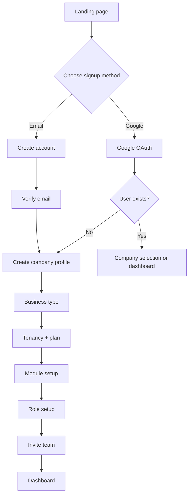

# ERP Google Auth Signup

Google authentication should be treated as a faster identity option for the ERP, not as a replacement for company setup. The ERP still needs the full onboarding flow after the user is authenticated.

## Recommended behavior

### 1. Landing page
Provide two entry points:

- Continue with Google
- Sign up with email

### 2. Google login flow
When the user selects Google:

- authenticate through Google OAuth
- read name and email
- link or create the user account
- continue to company selection or company creation

### 3. New user flow
For a first-time user:

- create the user profile
- continue to company onboarding
- do not skip business type, tenancy, plan, or module setup

### 4. Existing user flow
For a returning user:

- match by email
- if one company exists, redirect to that workspace
- if many companies exist, show company selector

## Important rule

Google auth should be used for identity and access, while the ERP company setup remains a separate, required business flow.

This keeps the onboarding fast without removing the key ERP decisions:

- company profile
- business type
- tenancy model
- subscription plan
- modules
- permissions
- team setup

## Security and enterprise notes

- prefer verified work email when possible
- support manual email signup as fallback
- keep company membership and permissions independent of Google login
- allow domain-based restrictions for enterprise accounts

## Summary

The best ERP signup pattern is:

Google auth or email signup → identity verification → company onboarding → ERP configuration → dashboard access

This gives a modern login experience while preserving the real ERP setup logic.
