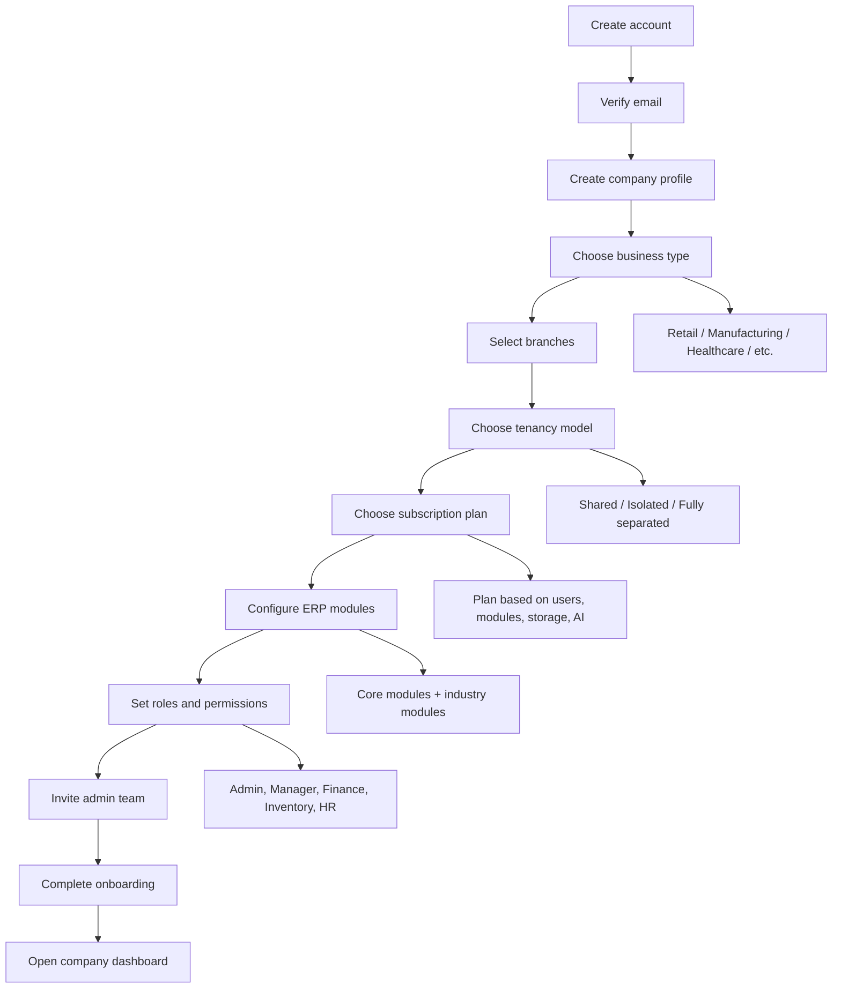

# ERP Initial Signup and Company Onboarding Flow

For an ERP platform, the signup flow should not be a basic SaaS registration. It must first establish the user, the company, the business model, and the operational context before the user enters the live ERP workspace.

## Recommended signup sequence

### 1. Create account
The first step is a standard user registration flow:

- Full name
- Work email
- Password
- Phone number
- Email verification
- Terms and privacy acceptance

This should be a clean, minimal step. Do not ask for too much business detail here.

### 2. Create company profile
Once account verification succeeds, the user becomes the initial company admin and creates the organization profile.

Required fields may include:

- Company name
- Legal/business name
- Country and timezone
- Currency
- Number of branches
- Initial employee/user estimate

### 3. Select business type
This is a critical ERP-specific step. A company may operate one or multiple business types.

Examples:

- Retail
- Manufacturing
- Healthcare
- Distribution
- Logistics
- Education
- Services

The business type drives:

- modules
- workflows
- dashboards
- permissions
- business rules
- UI configuration

### 4. Choose tenancy model
From the architecture documentation, the system supports multiple tenancy models.

Options:

- Shared tenancy
- Isolated tenancy with separate database(s)
- Fully separated architecture

This decision must be made during onboarding because it affects security, scalability, and subscription cost.

### 5. Choose subscription plan
The ERP is subscription-based, and the plan should be selected based on:

- business type
- number of branches
- number of users
- required modules
- storage
- AI features
- architecture choice

### 6. Configure ERP modules and roles
After the plan is selected, the system should present the relevant modules and role templates.

Typical role templates:

- Admin
- Finance Manager
- Inventory Manager
- HR Manager
- Branch Manager
- Sales Manager
- Operations Head

This is where company-based permissions begin to take shape.

### 7. Invite the first users
Once the company and modules are configured, the onboarding flow should invite the first team members.

Each invite should include:

- email
- role
- company access
- branch assignment if applicable

### 8. Finish onboarding and go to dashboard
The final step should redirect the user to a company dashboard with a guided checklist such as:

- company details
- users
- branches
- modules
- reports
- accounting settings
- integrations

This gives the admin a clear “first 10-minute setup” experience without overwhelming them.

## Why this flow is best for this ERP

This flow reflects the actual system requirements described in the architecture:

- multi-company access
- company-specific permissions
- business type-based configuration
- tenancy and subscription decisions
- branch-level structure
- dynamic ERP modules and UI

A basic signup form would not be enough because the ERP needs context before the user can work inside a real company workspace.

## Best-practice recommendation

Use a progressive onboarding flow instead of a single giant form. That means each page should focus on one decision only.

The flow should be:

1. Account setup
2. Company setup
3. Business/ERP configuration
4. Subscription plan
5. Team onboarding
6. Dashboard entry

This keeps the experience simple while still supporting the complexity of a real ERP.

## Summary

The best initial ERP signup flow is:

User registration → Company registration → Business type selection → Tenant model and plan → Module setup → Role setup → Invite users → Dashboard access

This is the strongest onboarding path for an enterprise-grade ERP and aligns directly with the product architecture described in the existing documentation.
