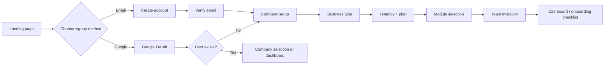

# ERP Signup Wireframes and Onboarding Screens

This page shows the practical screen-by-screen onboarding flow for the ERP signup experience. It translates the architecture and business requirements into a clearer user experience for the initial company setup.

## High-level onboarding flow



## Screen 1: Landing page

Purpose: explain the ERP value and provide the signup options.

```text
+-----------------------------------------------------------+
| ERP Platform                                              |
| Smart business operations for every company                |
|                                                           |
| [Continue with Google]                                     |
| [Sign up with email]                                       |
| [Already have an account? Sign in]                         |
|                                                           |
| Why businesses choose us                                  |
| - Multi-company management                                |
| - Role-based access                                        |
| - Industry-specific workflows                              |
| - AI-powered insights                                     |
+-----------------------------------------------------------+
```

### Contents

- short value proposition
- primary CTA: Continue with Google
- secondary CTA: Sign up with email
- sign-in link for returning users
- trust signals for enterprise use

### UX note

This page should not ask the user to configure a full ERP immediately. It should invite them into a guided setup process.

## Screen 2: Google sign-in / email signup choice

Purpose: reduce friction while still supporting standard enterprise onboarding.

```text
+-----------------------------------------------------------+
| Welcome                                                     |
|                                                           |
| [Continue with Google]                                     |
|                                                           |
| or                                                      |
|                                                           |
| Full name                    [____________________]        |
| Work email                   [____________________]        |
| Password                     [____________________]        |
| Phone number                 [____________________]        |
|                                                           |
| [I agree to Terms and Privacy Policy]                    |
|                                                           |
| [Create account]                                          |
+-----------------------------------------------------------+
```

### UX note

Google is shown as the fastest path, but email signup remains available for enterprise users who prefer traditional registration.

## Screen 3: Email verification

Purpose: validate identity before company setup begins.

```text
+-----------------------------------------------------------+
| Verify your email                                          |
|                                                           |
| We sent a 6-digit code to                                |
| hello@company.com                                          |
|                                                           |
| [  _  _  _  _  _  _ ]                                      |
|                                                           |
| [Verify email] [Resend code]                              |
+-----------------------------------------------------------+
```

### UX notes

- show email prefilled
- allow resend with cooldown
- support alternate methods if needed

## Screen 4: Company setup

Purpose: create the company profile and initial business identity.

```text
+-----------------------------------------------------------+
| Set up your company                                        |
|                                                           |
| Company name              [____________________]           |
| Legal name                [____________________]           |
| Country                   [Select country]                 |
| Timezone                  [Select timezone]                 |
| Currency                  [Select currency]                |
| Number of branches        [Select]                         |
| Employee count            [Select]                         |
|                                                           |
| [Continue]                                                 |
+-----------------------------------------------------------+
```

### Important data

- company legal name
- country and timezone
- default currency
- number of branches
- expected users

### UX note

This is the point where the organization becomes real inside the ERP system.

## Screen 5: Business type selection

Purpose: determine the ERP shape, modules, and operating workflows.

```text
+-----------------------------------------------------------+
| What type of business are you running?                     |
|                                                           |
| [ ] Retail / Store                                        |
| [ ] Manufacturing                                         |
| [ ] Healthcare                                            |
| [ ] Distribution / Wholesale                              |
| [ ] Logistics / Transport                                  |
| [ ] Education                                             |
| [ ] Services                                              |
| [ ] Multi-business organization                            |
|                                                           |
| [Continue]                                                 |
+-----------------------------------------------------------+
```

### Why it matters

This step directly affects:

- default modules
- dashboard layout
- workflows
- role templates
- business rules

### UX note

Allow multiple selection if the company operates more than one business type.

## Screen 6: Tenancy and architecture selection

Purpose: define how data and isolation are handled.

```text
+-----------------------------------------------------------+
| Choose your data and tenancy model                        |
|                                                           |
| O Shared tenancy                                           |
|   Best for smaller businesses with standard needs          |
|                                                           |
| O Isolated tenancy                                          |
|   Separate tenant or database for better isolation       |
|                                                           |
| O Fully separated architecture                             |
|   Highest control and strongest security                  |
|                                                           |
| [Continue]                                                 |
+-----------------------------------------------------------+
```

### This is ERP-specific

The architecture is not a generic SaaS decision. It affects:

- security model
- database design
- operations scale
- enterprise readiness

## Screen 7: Subscription plan selection

Purpose: choose the right ERP package.

```text
+-----------------------------------------------------------+
| Select your subscription plan                             |
|                                                           |
| Starter    $29/mo   Basic modules                         |
| Growth     $99/mo   Multi-branch, automation              |
| Scale      $299/mo  Advanced AI + custom modules          |
| Enterprise Custom    Security + full control              |
|                                                           |
| [Continue]                                                 |
+-----------------------------------------------------------+
```

### Plan factors

- business type
- branches
- users
- module count
- AI features
- storage
- architecture tier

## Screen 8: Module configuration

Purpose: confirm the ERP modules needed by the company.

```text
+-----------------------------------------------------------+
| Configure your ERP modules                                 |
|                                                           |
| [x] Core accounting                                        |
| [x] Inventory and stock                                   |
| [ ] HR and payroll                                         |
| [x] Sales and invoicing                                   |
| [ ] Procurement                                            |
| [ ] Manufacturing operations                              |
| [ ] Reporting and analytics                                |
| [ ] AI automation                                          |
|                                                           |
| [Continue]                                                 |
+-----------------------------------------------------------+
```

### UX note

This screen should show recommended modules based on business type, with editable defaults.

## Screen 9: Role and permission setup

Purpose: create the initial role model.

```text
+-----------------------------------------------------------+
| Set up roles for your team                                 |
|                                                           |
| Admin            [Owner access]                            |
| Finance Manager  [Accounting and payments]                 |
| Inventory Manager [Stock and items]                       |
| HR Manager       [Employees and attendance]               |
| Branch Manager   [Local operations and reports]           |
| Sales Manager    [Orders, customers, invoicing]           |
|                                                           |
| [Continue]                                                 |
+-----------------------------------------------------------+
```

### Why this matters

This matches the architecture requirement that roles and permissions are company-based and may differ across companies for the same user.

## Screen 10: Invite team members

Purpose: bring the company administrators and department heads into the system.

```text
+-----------------------------------------------------------+
| Invite your team                                            |
|                                                           |
| Name / email                Role / Department             |
| John Doe     john@company.com   Admin                       |
| Sarah Chen   finance@company.com Finance Manager           |
| + Add another team member                                  |
|                                                           |
| [Send invites] [Skip for now]                             |
+-----------------------------------------------------------+
```

### UX note

This should be optional but recommended. The first user often starts as the ERP admin and adds the rest later.

## Screen 11: Final onboarding checklist

Purpose: create a clean transition into the live ERP dashboard.

```text
+-----------------------------------------------------------+
| You're ready to start                                     |
|                                                           |
| [x] Company created                                        |
| [x] Business type selected                                 |
| [x] Tenancy model configured                               |
| [x] Subscription selected                                  |
| [x] Modules enabled                                        |
| [x] Roles configured                                       |
| [ ] Invite team members                                     |
| [ ] Import initial data                                     |
| [ ] Configure reports and dashboards                       |
|                                                           |
| [Go to dashboard]                                          |
+-----------------------------------------------------------+
```

### This should be the first landing page after signup

The user should see progress and a clear next action list instead of a blank dashboard.

## Recommended UX principle

Use progressive onboarding, not a single giant form. This is especially important for ERP products because the company setup is complex.

A good default flow is:

1. Google sign-in or email signup
2. Verify email if needed
3. Company details
4. Business type
5. Tenancy model
6. Subscription
7. Module configuration
8. Roles
9. Invite team
10. Dashboard and first checklist

## Summary

This onboarding model matches the ERP architecture described in the project docs:

- admin-led company setup
- multi-company and multi-branch awareness
- business-type-based configuration
- role-based permissions
- subscription-based module choice
- guided dashboard onboarding
- Google sign-in as preferred identity option

This is the most practical and scalable initial signup experience for a real ERP product.

Purpose: validate identity before company setup begins.

```text
+-----------------------------------------------------------+
| Verify your email                                          |
|                                                           |
| We sent a 6-digit code to                                |
| hello@company.com                                          |
|                                                           |
| [  _  _  _  _  _  _ ]                                      |
|                                                           |
| [Verify email] [Resend code]                              |
+-----------------------------------------------------------+
```

### UX notes

- show email prefilled
- allow resend with cooldown
- support alternate methods if needed

## Screen 4: Company setup

Purpose: create the company profile and initial business identity.

```text
+-----------------------------------------------------------+
| Set up your company                                        |
|                                                           |
| Company name              [____________________]           |
| Legal name                [____________________]           |
| Country                   [Select country]                 |
| Timezone                  [Select timezone]                 |
| Currency                  [Select currency]                |
| Number of branches        [Select]                         |
| Employee count            [Select]                         |
|                                                           |
| [Continue]                                                 |
+-----------------------------------------------------------+
```

### Important data

- company legal name
- country and timezone
- default currency
- number of branches
- expected users

### UX note

This is the point where the organization becomes real inside the ERP system.

## Screen 5: Business type selection

Purpose: determine the ERP shape, modules, and operating workflows.

```text
+-----------------------------------------------------------+
| What type of business are you running?                     |
|                                                           |
| [ ] Retail / Store                                        |
| [ ] Manufacturing                                         |
| [ ] Healthcare                                            |
| [ ] Distribution / Wholesale                              |
| [ ] Logistics / Transport                                  |
| [ ] Education                                             |
| [ ] Services                                              |
| [ ] Multi-business organization                            |
|                                                           |
| [Continue]                                                 |
+-----------------------------------------------------------+
```

### Why it matters

This step directly affects:

- default modules
- dashboard layout
- workflows
- role templates
- business rules

### UX note

Allow multiple selection if the company operates more than one business type.

## Screen 6: Tenancy and architecture selection

Purpose: define how data and isolation are handled.

```text
+-----------------------------------------------------------+
| Choose your data and tenancy model                        |
|                                                           |
| O Shared tenancy                                           |
|   Best for smaller businesses with standard needs          |
|                                                           |
| O Isolated tenancy                                          |
|   Separate tenant or database for better isolation       |
|                                                           |
| O Fully separated architecture                             |
|   Highest control and strongest security                  |
|                                                           |
| [Continue]                                                 |
+-----------------------------------------------------------+
```

### This is ERP-specific

The architecture is not a generic SaaS decision. It affects:

- security model
- database design
- operations scale
- enterprise readiness

## Screen 7: Subscription plan selection

Purpose: choose the right ERP package.

```text
+-----------------------------------------------------------+
| Select your subscription plan                             |
|                                                           |
| Starter    $29/mo   Basic modules                         |
| Growth     $99/mo   Multi-branch, automation              |
| Scale      $299/mo  Advanced AI + custom modules          |
| Enterprise Custom    Security + full control              |
|                                                           |
| [Continue]                                                 |
+-----------------------------------------------------------+
```

### Plan factors

- business type
- branches
- users
- module count
- AI features
- storage
- architecture tier

## Screen 8: Module configuration

Purpose: confirm the ERP modules needed by the company.

```text
+-----------------------------------------------------------+
| Configure your ERP modules                                 |
|                                                           |
| [x] Core accounting                                        |
| [x] Inventory and stock                                   |
| [ ] HR and payroll                                         |
| [x] Sales and invoicing                                   |
| [ ] Procurement                                            |
| [ ] Manufacturing operations                              |
| [ ] Reporting and analytics                                |
| [ ] AI automation                                          |
|                                                           |
| [Continue]                                                 |
+-----------------------------------------------------------+
```

### UX note

This screen should show recommended modules based on business type, with editable defaults.

## Screen 9: Role and permission setup

Purpose: create the initial role model.

```text
+-----------------------------------------------------------+
| Set up roles for your team                                 |
|                                                           |
| Admin            [Owner access]                            |
| Finance Manager  [Accounting and payments]                 |
| Inventory Manager [Stock and items]                       |
| HR Manager       [Employees and attendance]               |
| Branch Manager   [Local operations and reports]           |
| Sales Manager    [Orders, customers, invoicing]           |
|                                                           |
| [Continue]                                                 |
+-----------------------------------------------------------+
```

### Why this matters

This matches the architecture requirement that roles and permissions are company-based and may differ across companies for the same user.

## Screen 10: Invite team members

Purpose: bring the company administrators and department heads into the system.

```text
+-----------------------------------------------------------+
| Invite your team                                            |
|                                                           |
| Name / email                Role / Department             |
| John Doe     john@company.com   Admin                       |
| Sarah Chen   finance@company.com Finance Manager           |
| + Add another team member                                  |
|                                                           |
| [Send invites] [Skip for now]                             |
+-----------------------------------------------------------+
```

### UX note

This should be optional but recommended. The first user often starts as the ERP admin and adds the rest later.

## Screen 11: Final onboarding checklist

Purpose: create a clean transition into the live ERP dashboard.

```text
+-----------------------------------------------------------+
| You're ready to start                                     |
|                                                           |
| [x] Company created                                        |
| [x] Business type selected                                 |
| [x] Tenancy model configured                               |
| [x] Subscription selected                                  |
| [x] Modules enabled                                        |
| [x] Roles configured                                       |
| [ ] Invite team members                                     |
| [ ] Import initial data                                     |
| [ ] Configure reports and dashboards                       |
|                                                           |
| [Go to dashboard]                                          |
+-----------------------------------------------------------+
```

### This should be the first landing page after signup

The user should see progress and a clear next action list instead of a blank dashboard.

## Recommended UX principle

Use progressive onboarding, not a single giant form. This is especially important for ERP products because the company setup is complex.

A good default flow is:

1. Create account
2. Verify email
3. Company details
4. Business type
5. Tenancy model
6. Subscription
7. Module configuration
8. Roles
9. Invite team
10. Dashboard and first checklist

## Summary

This onboarding model matches the ERP architecture described in the project docs:

- admin-led company setup
- multi-company and multi-branch awareness
- business-type-based configuration
- role-based permissions
- subscription-based module choice
- guided dashboard onboarding

This is the most practical and scalable initial signup experience for a real ERP product.
