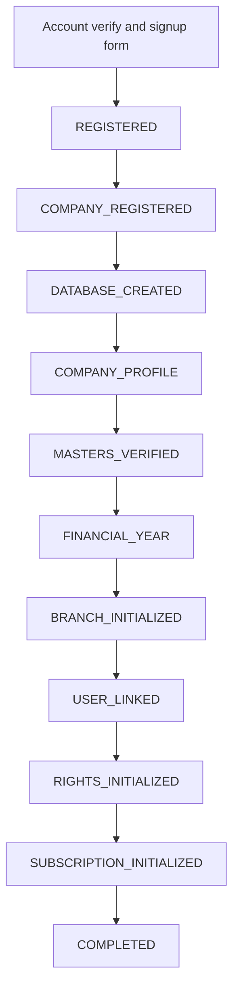

# Niyanthra ERP — Company Onboarding Process

> **Simplify. Manage. Grow.**

Signup collects the account and company form in one go. The platform then creates the **global user**, allocates a company, provisions that company’s PostgreSQL database, seeds mandatory masters, and wires financial year, default branch, owner rights, and a **10-day trial**. The user gets an onboarding id immediately; the rest runs as **staged background provision**.

This page is the process and database specification. Login schemas, tenant isolation rules, and permission catalogs remain in Sujith’s docs. Plan catalog detail beyond trial is a later Tintu page. This page does **not** name application files or HTTP routes.

---

## Table of Contents

1. [Overview](#1-overview)
2. [Two databases](#2-two-databases)
3. [Database naming](#3-database-naming)
4. [Signup payload](#4-signup-payload)
5. [Staged provision](#5-staged-provision)
6. [End-to-end sequence](#6-end-to-end-sequence)
7. [Master database tables](#7-master-database-tables)
8. [Tenant database — mandatory seed](#8-tenant-database--mandatory-seed)
9. [What is not seeded](#9-what-is-not-seeded)
10. [Trial subscription at signup](#10-trial-subscription-at-signup)
11. [Onboarding status and polling](#11-onboarding-status-and-polling)
12. [After onboarding](#12-after-onboarding)
13. [Rules to lock](#13-rules-to-lock)
14. [Example — ABC Paints](#14-example--abc-paints)

---

## 1. Overview

Onboarding starts when a person has **no ready company**. The web form captures user + company details. Email must be unused. After the form is accepted:

| Result | Meaning |
| ------ | ------- |
| Global user | Identity in the Master database |
| Onboarding row | Job tracker returned immediately |
| Organization + company | Business container + legal entity |
| Tenant database | Per-company PostgreSQL (`dXXXXXtenant` when dedicated) |
| Seeded masters | Entry types, ledgers, units, tax, vouchers, rights — so screens work on first login |
| Default FY + HO branch | From signup dates; branch code `HO`, name = company name |
| Owner rights | Super Admin (user level 1), full CRUD |
| 10-day trial | Company-level trial; all modules if the plan has no module rows yet |

```text
Signup form
    │
    ▼
REGISTERED  (user + onboarding row, return onboarding_id)
    │
    ▼
Background stages (11 steps)
    │
    ▼
Company ready → ERP dashboard
```

Signup does **not** restore a backup. The tenant database is created empty, schema is applied, then seed runs.

Invited staff skip this flow. They are linked to an existing company later.

---

## 2. Two databases

| Database | Role | Typical name |
| -------- | ---- | ------------ |
| **Master** | Shared global store: users, organizations, companies, onboarding jobs, memberships, tenants, subscriptions, plan catalog | `niyanthra_master` |
| **Tenant** | Per-company operational store: masters, vouchers, stock, parties, transactions | Dedicated: `dXXXXXtenant`. Shared tenancy: `niyanthra_shared` + `tenant_id` |

```text
niyanthra_master
    users, companies, company_onboarding,
    organization_*, tenants, subscriptions

d00017tenant          (example: company id 17, dedicated)
    entry types, ledgers, vouchers, FY, branch,
    owner user row, rights — not items/customers/txns
```

Master never holds sales, purchase, or inventory transactions. The tenant database never holds platform identity or billing.

Hybrid tenancy still applies:

| `tenant_type` | What DATABASE_CREATED does |
| ------------- | -------------------------- |
| `SHARED` | Register the tenant on `niyanthra_shared`. No `CREATE DATABASE`. Isolate with `tenant_id`. |
| `DEDICATED` | `CREATE DATABASE dXXXXXtenant` (UTF-8). Apply schema. Seed. |
| `SILO` | Dedicated database plus isolated Redis namespace / worker queue recorded on `tenant_resources`. |

Default for first-time signup is `SHARED` unless the form selects otherwise. Trial does not require silo.

---

## 3. Database naming

Dedicated (and silo) tenant databases follow a stable formula from the allocated company id. No user-supplied database name is trusted.

```text
d + CompanyID zero-padded to 5 digits + tenant
```

| Company id | Database name |
| ---------- | ------------- |
| 1 | `d00001tenant` |
| 17 | `d00017tenant` |
| 1042 | `d01042tenant` |

That name is stored on `tenant_resources.database_name`. Shared tenants store `niyanthra_shared` and a schema or `tenant_id` instead.

---

## 4. Signup payload

Collected before any company row exists. Email uniqueness is checked and the address is verified first. Nothing is written until the signup is accepted.

| Field | Required | Notes |
| ----- | -------- | ----- |
| `username` | Yes | Display / login name |
| `email` | Yes | Unique in `users` |
| `password` | Yes | Stored hashed on `users` (never plain, never reversible) |
| `company_details.name` | Yes | Legal / display name |
| `company_details.address` | Yes | Registered / HO address text |
| `company_details.contact` | Yes | Phone |
| `company_details.fy_sdate` | Yes | Financial year start |
| `company_details.fy_edate` | Yes | Financial year end (must be after start) |
| `tenant_type` | No | `SHARED` / `DEDICATED` / `SILO`. Default `SHARED` |

The accepted payload is stored on `company_onboarding.signup_payload` (JSONB) so background stages can replay it.

---

## 5. Staged provision

| | |
| --- | --- |
| 2 databases | Master + per-company tenant |
| 12 stages | 1–2 interactive, 3–12 background |
| 10 days | Trial subscription |

Stage names are written to `company_onboarding.current_stage` and to one row per stage in `company_onboarding_steps`.



If any background stage fails, `company_onboarding.status` becomes `failed`, `current_stage` stays on the failed stage, and later stages are not run. The tenant, if created, is marked `FAILED`. Retry re-runs from the failed stage; it does not allocate a second company id.

---

## 6. End-to-end sequence

| # | Where | Stage | What is written |
| - | ----- | ----- | --------------- |
| 1 | Web | Account + email verify | **Nothing yet.** Confirm the email is unused and verified. |
| 2 | Web | Submit signup | Forward username, email, password, company name/address/contact, FY start/end. |
| 3 | API (sync) | `REGISTERED` | `users` row (hashed password) + `company_onboarding` row. **Return `onboarding_id` immediately.** UI polls status. |
| 4 | Background | `COMPANY_REGISTERED` | `organizations` (default `SINGLE_BUSINESS`, name = company name) + owner `organization_memberships` + `companies` (allocates `companies.id`) + `tenants` (`PROVISIONING`). Link `companies.tenant_id`. |
| 5 | Background | `DATABASE_CREATED` | Dedicated/silo: `CREATE DATABASE dXXXXXtenant` UTF-8, apply schema, run seed. Shared: register tenant on shared DB and seed into that tenant’s rows. Write `tenant_resources`. |
| 6 | Background | `COMPANY_PROFILE` | Overwrite the tenant company-profile placeholder (`NIYANTHRA`) with signup name, address, phone. |
| 7 | Background | `MASTERS_VERIFIED` | Count-check rights, formulas, language, units, entry types. Fail the job if a required catalog is empty. |
| 8 | Background | `FINANCIAL_YEAR` | Tenant `financial_years` `id = 1`, dates from signup, `is_closed = false`. Master `company_financial_settings` (currency INR default, same FY dates). |
| 9 | Background | `BRANCH_INITIALIZED` | Master `branches` + `branch_locations` and tenant `branch_master`: `id = 1`, code `HO`, name = company name. |
| 10 | Background | `USER_LINKED` | Master `company_memberships` (admin). Tenant `users`: owner, `user_level = 1`, `branch_id = 1`. Delete seed template users (ids 1–2). |
| 11 | Background | `RIGHTS_INITIALIZED` | Copy full `rights_master` into owner `user_rights` + `user_right_allocations` (create/edit/delete/view/print/export all true). |
| 12 | Background | `SUBSCRIPTION_INITIALIZED` | Master `company_subscriptions` trial, **10 days**, `is_active = true`. If `plan_modules` is empty for trial, grant **all** `modules`. Company `status = active`. Onboarding `COMPLETED`. Tenant `ACTIVE`. |

---

## 7. Master database tables

Platform tables used by onboarding. Existing org/company/tenant columns stay as in the login and tenant docs; this section adds the **onboarding and trial** structures and the fields those stages need.

### 7.1 `users`

Global identity. Created at `REGISTERED`.

| Field | Type | Notes |
| ----- | ---- | ----- |
| `id` | BIGINT PK | Internal id |
| `public_id` | UUID UNIQUE | API-safe id |
| `username` | VARCHAR(150) | From signup |
| `email` | VARCHAR(255) UNIQUE | From signup |
| `password_hash` | VARCHAR(255) | Hashed; never store plain text |
| `status` | VARCHAR(30) | `active` after verify |
| `created_at` | TIMESTAMP | |
| `updated_at` | TIMESTAMP | |
| `deleted_at` | TIMESTAMP NULL | Soft delete |

### 7.2 `company_onboarding`

Job record. Created at `REGISTERED`. This is what the UI polls.

| Field | Type | Notes |
| ----- | ---- | ----- |
| `id` | BIGINT PK | Internal id |
| `public_id` | UUID UNIQUE | **`onboarding_id` returned to the client** |
| `user_id` | BIGINT FK | Set at `REGISTERED` → `users.id` |
| `organization_id` | BIGINT FK NULL | Set at `COMPANY_REGISTERED` |
| `company_id` | BIGINT FK NULL | Set at `COMPANY_REGISTERED` |
| `tenant_id` | BIGINT FK NULL | Set at `COMPANY_REGISTERED` |
| `current_stage` | VARCHAR(50) | See stage list below |
| `status` | VARCHAR(30) | `in_progress` · `completed` · `failed` |
| `tenant_type` | VARCHAR(30) | `SHARED` · `DEDICATED` · `SILO` |
| `signup_payload` | JSONB | Frozen form: name, address, contact, FY dates |
| `error_message` | TEXT NULL | Last stage error |
| `started_at` | TIMESTAMP | |
| `completed_at` | TIMESTAMP NULL | Set on `COMPLETED` or `failed` |
| `created_at` | TIMESTAMP | |
| `updated_at` | TIMESTAMP | |

**`current_stage` values**

`REGISTERED` · `COMPANY_REGISTERED` · `DATABASE_CREATED` · `COMPANY_PROFILE` · `MASTERS_VERIFIED` · `FINANCIAL_YEAR` · `BRANCH_INITIALIZED` · `USER_LINKED` · `RIGHTS_INITIALIZED` · `SUBSCRIPTION_INITIALIZED` · `COMPLETED`

### 7.3 `company_onboarding_steps`

One row per stage for audit and the status screen.

| Field | Type | Notes |
| ----- | ---- | ----- |
| `id` | BIGINT PK | |
| `onboarding_id` | BIGINT FK | → `company_onboarding.id` |
| `stage` | VARCHAR(50) | Same codes as `current_stage` |
| `status` | VARCHAR(30) | `pending` · `running` · `success` · `failed` · `skipped` |
| `detail` | JSONB NULL | Counts, database name, ids written |
| `error_message` | TEXT NULL | |
| `started_at` | TIMESTAMP NULL | |
| `completed_at` | TIMESTAMP NULL | |
| `created_at` | TIMESTAMP | |
| `updated_at` | TIMESTAMP | |

Unique: `(onboarding_id, stage)`.

### 7.4 `organizations` / `organization_memberships`

Created at `COMPANY_REGISTERED`. First signup uses `organization_type = SINGLE_BUSINESS` and `name` = company name. The user is `owner`, `status = active`. Column lists stay in the [Login Flow](../sujith/doc1-loginflow.md).

### 7.5 `companies`

Allocated at `COMPANY_REGISTERED`. `id` is the number used in `dXXXXXtenant`.

| Field | Type | Notes |
| ----- | ---- | ----- |
| `id` | BIGINT PK | **CompanyID** used in dedicated DB name |
| `public_id` | UUID UNIQUE | |
| `organization_id` | BIGINT FK | |
| `tenant_id` | BIGINT FK NULL | Set when tenant row is created |
| `name` | VARCHAR(150) | From signup |
| `code` | VARCHAR(50) | Generated unique (e.g. from slug + id) |
| `status` | VARCHAR(30) | `pending` until `SUBSCRIPTION_INITIALIZED`, then `active` |
| `address` | VARCHAR(500) NULL | From signup |
| `contact_phone` | VARCHAR(30) NULL | From signup |
| `total_users` | INTEGER | Licence cap for tenant users. Default (e.g. 5) on trial |
| `timezone` | VARCHAR(100) | Default `Asia/Kolkata` |
| `date_format` | VARCHAR(30) | Default `dd/MM/yyyy` |
| `created_by` | BIGINT FK | Owner user |
| `created_at` | TIMESTAMP | |
| `updated_at` | TIMESTAMP | |
| `deleted_at` | TIMESTAMP NULL | |

`company_types`, extra legal fields, and business profile can be filled after first login. They are not required to finish staged provision.

### 7.6 `tenants` / `tenant_resources`

Created at `COMPANY_REGISTERED` / `DATABASE_CREATED`. See [Tenant Flow](../sujith/doc3-tenant-flow.md).

`tenant_resources.database_name` examples:

- Dedicated company 17 → `d00017tenant`
- Shared → `niyanthra_shared` with `database_schema` or tenant key

### 7.7 `company_memberships`

Created at `USER_LINKED`.

| Field | Type | Notes |
| ----- | ---- | ----- |
| `id` | BIGINT PK | |
| `public_id` | UUID UNIQUE | |
| `company_id` | BIGINT FK | |
| `user_id` | BIGINT FK | Owner |
| `role` | VARCHAR(30) | `admin` for the signup user |
| `user_level` | SMALLINT | `1` Super Admin · `2` Admin · `3` User |
| `status` | VARCHAR(30) | `active` |
| `created_at` | TIMESTAMP | |
| `updated_at` | TIMESTAMP | |
| `deleted_at` | TIMESTAMP NULL | |

Organization role ≠ company role.

### 7.8 `modules`

Platform catalog. Seeded once in Master, not per company.

| Field | Type | Notes |
| ----- | ---- | ----- |
| `id` | BIGINT PK | |
| `public_id` | UUID UNIQUE | |
| `name` | VARCHAR(100) | |
| `code` | VARCHAR(50) UNIQUE | e.g. `sales`, `purchase`, `inventory`, `webdashboard-sales` |
| `parent_code` | VARCHAR(50) NULL | Parent module for voucher mapping |
| `status` | VARCHAR(30) | `active` |
| `created_at` | TIMESTAMP | |
| `updated_at` | TIMESTAMP | |

### 7.9 `subscription_plans`

| Field | Type | Notes |
| ----- | ---- | ----- |
| `id` | BIGINT PK | |
| `public_id` | UUID UNIQUE | |
| `code` | VARCHAR(50) UNIQUE | `trial` · `standard-monthly` · `standard-yearly` |
| `name` | VARCHAR(100) | |
| `price` | DECIMAL(12,2) | Trial `0`. Monthly `500`. Yearly `6000` (platform currency) |
| `duration_days` | INTEGER | Trial `10`. Monthly `30`. Yearly `365` |
| `status` | VARCHAR(30) | `active` |
| `created_at` | TIMESTAMP | |
| `updated_at` | TIMESTAMP | |

Ensure these three rows exist before any signup (platform seed). Signup **always** attaches `trial`. Paid plans are chosen after go-live (later subscription doc).

### 7.10 `plan_modules`

| Field | Type | Notes |
| ----- | ---- | ----- |
| `id` | BIGINT PK | |
| `plan_id` | BIGINT FK | → `subscription_plans` |
| `module_id` | BIGINT FK | → `modules` |
| `is_accessible` | BOOLEAN | |
| `created_at` | TIMESTAMP | |
| `updated_at` | TIMESTAMP | |

If trial has **no** `plan_modules` rows, `SUBSCRIPTION_INITIALIZED` grants every active module to the company.

### 7.11 `company_subscriptions`

Company-level subscription. Written at `SUBSCRIPTION_INITIALIZED`. Branches do not subscribe separately.

| Field | Type | Notes |
| ----- | ---- | ----- |
| `id` | BIGINT PK | |
| `public_id` | UUID UNIQUE | |
| `company_id` | BIGINT FK | |
| `plan_id` | BIGINT FK | Trial plan |
| `starts_at` | TIMESTAMP | Now |
| `ends_at` | TIMESTAMP | `starts_at + 10 days` |
| `is_active` | BOOLEAN | `true` |
| `is_trial` | BOOLEAN | `true` |
| `created_by` | BIGINT FK | Owner user |
| `created_at` | TIMESTAMP | |
| `updated_at` | TIMESTAMP | |

### 7.12 `company_modules`

Enabled capabilities after trial grant.

| Field | Type | Notes |
| ----- | ---- | ----- |
| `id` | BIGINT PK | |
| `company_id` | BIGINT FK | |
| `module_id` | BIGINT FK | |
| `status` | VARCHAR(30) | `active` |
| `enabled_at` | TIMESTAMP | |
| `enabled_by` | BIGINT FK NULL | Owner |
| `created_at` | TIMESTAMP | |
| `updated_at` | TIMESTAMP | |

### 7.13 `company_financial_settings`

Written at `FINANCIAL_YEAR` (master copy of FY defaults).

| Field | Type | Notes |
| ----- | ---- | ----- |
| `id` | BIGINT PK | |
| `company_id` | BIGINT FK UNIQUE | |
| `base_currency_code` | VARCHAR(10) | Default `INR` |
| `fiscal_year_start` | DATE | From signup `fy_sdate` |
| `fiscal_year_end` | DATE | From signup `fy_edate` |
| `accounting_method` | VARCHAR(30) | Default `accrual` |
| `decimal_precision` | SMALLINT | Default `2` |
| `rounding_method` | VARCHAR(30) | Default `nearest` |
| `created_at` | TIMESTAMP | |
| `updated_at` | TIMESTAMP | |

---

## 8. Tenant database — mandatory seed

Runs inside `DATABASE_CREATED` (`_insert` of global masters). These rows are required so vouchers, accounts, and screens work on first login.

During schema apply, a **placeholder** company profile row is inserted (`name = NIYANTHRA`). `COMPANY_PROFILE` overwrites it with the signup name/address/phone. `financial_years` is cleared during init and rewritten in `FINANCIAL_YEAR`.

Dedicated database charset: UTF-8 (`UTF8` / `en_US.UTF-8` collation as platform standard).

### 8.1 Masters and chart of accounts

| Table | Seeded rows | Purpose |
| ----- | ----------- | ------- |
| `entry_master` | Receipts … Payslip (`id` 1–24) | Entry / voucher types |
| `ledger_groups` | 27 groups (Assets / Liabilities / Income / Expense tree) | Account groups |
| `ledger_master` | Cash in Hand, Bank, Sales, Purchase, Capital, GST/VAT input-output, Round Off, P&L A/c, … | Default ledgers; **balances reset to 0** |
| `group_master` | Base Group (`id = 1`) | Item group root |
| `item_categories` | Base Category | Item category root |
| `location_master` | Base Location | Stock location root |
| `area_master` | Base Area | Area root |
| `unit_master` | Nos, Kg, Lts, Dz, Set | Units of measure |
| `tax_master` | Non-taxable 0%; GST 5 / 12 / 18 / 28 (or VAT 0 / 1 / 4 / 12.5 until localization) | Linked to tax ledgers |
| `customer_type_master` | Regular, Cash only, Walk in, Privileged | Party types |
| `balance_sheet_layout` | Asset, Liability | BS structure |
| `profit_loss_layout` | Expense, Income | P&L structure |

#### `entry_master`

| Field | Type | Notes |
| ----- | ---- | ----- |
| `id` | BIGINT PK | 1–24 seeded |
| `code` | VARCHAR(20) UNIQUE | e.g. `LP`, `CTRA`, `JV` |
| `name` | VARCHAR(100) | |
| `entry_class` | VARCHAR(50) | sales · purchase · finance · inventory · production · payroll |
| `status` | VARCHAR(30) | `active` |

#### `ledger_master` (seed shape)

| Field | Type | Notes |
| ----- | ---- | ----- |
| `id` | BIGINT PK | Stable ids so voucher settings can point at Cash (`8`), Sales, Purchase, Round Off |
| `name` | VARCHAR(150) | |
| `ledger_group_id` | BIGINT FK | |
| `opening_balance` | DECIMAL(18,4) | Seed **0** |
| `status` | VARCHAR(30) | `active` |

Cash in Hand is seeded at a **fixed id** (e.g. `8`) so voucher settings can set `cash_account_ledger_id = 8`. Sales / Purchase / return ledgers similarly use stable ids for `stock_group_ledgers`.

#### `unit_master`

| Field | Type | Notes |
| ----- | ---- | ----- |
| `id` | BIGINT PK | |
| `code` | VARCHAR(20) | `NOS` · `KG` · `LTS` · `DZ` · `SET` |
| `name` | VARCHAR(50) | |
| `status` | VARCHAR(30) | `active` |

#### `tax_master`

| Field | Type | Notes |
| ----- | ---- | ----- |
| `id` | BIGINT PK | |
| `name` | VARCHAR(100) | |
| `rate` | DECIMAL(8,4) | |
| `tax_type` | VARCHAR(30) | `NONE` · `GST` · `VAT` |
| `input_ledger_id` | BIGINT FK NULL | |
| `output_ledger_id` | BIGINT FK NULL | |
| `status` | VARCHAR(30) | `active` |

### 8.2 Vouchers, fields, and formulas

| Table | What is set up |
| ----- | -------------- |
| `voucher_master` | Contra, JV, DN/CN, Bank/Cash Receipts & Payments, Local/Interstate Purchase, Sales, Purchase Return, Sales Return, Transfer, Production, PO, SO. Codes such as `LP`, `CTRA`, `JV` |
| `formula_def_details` | Line fields: `Discount=((Qty*Rate)*Discount_Percent)/100`, tax from `Tax_Percent`, `ItemTotal`, `GrossValue`, `Net Amount` |
| `formula_def_headers` | Header totals: SubTotal, Disc Total, Tax Total, Qty Total, Net Amount Total |
| `voucher_column_settings` | Item-grid column order: SLNO, Item Name, Tax %, Qty, Unit, Rate, Disc %, Batch, … |
| `voucher_settings` | Per-voucher flags: auto bill no, connect with accounts/stock, show tax, allow edit rate, `cash_account_ledger_id = 8`, round-off ledgers |
| `stock_group_ledgers` | Base Group → Purchase account / Sales account / returns |
| `inventory_settings` | Tax on, costing FIFO, qty 2 decimals, single location |

#### `voucher_master`

| Field | Type | Notes |
| ----- | ---- | ----- |
| `id` | BIGINT PK | |
| `entry_id` | BIGINT FK | → `entry_master` |
| `code` | VARCHAR(20) UNIQUE | |
| `name` | VARCHAR(100) | |
| `status` | VARCHAR(30) | `active` |

#### `voucher_settings`

| Field | Type | Notes |
| ----- | ---- | ----- |
| `id` | BIGINT PK | |
| `voucher_id` | BIGINT FK UNIQUE | |
| `auto_bill_no` | BOOLEAN | |
| `connect_with_accounts` | BOOLEAN | |
| `connect_with_stock` | BOOLEAN | |
| `show_tax` | BOOLEAN | |
| `allow_edit_rate` | BOOLEAN | |
| `cash_account_ledger_id` | BIGINT FK NULL | Seed `8` (Cash in Hand) |
| `round_off_ledger_id` | BIGINT FK NULL | |

#### `formula_def_details`

| Field | Type | Notes |
| ----- | ---- | ----- |
| `id` | BIGINT PK | |
| `voucher_id` | BIGINT FK | |
| `field_name` | VARCHAR(100) | |
| `formula` | TEXT | Expression string |
| `sort_order` | INTEGER | |

### 8.3 Settings, rights, language

| Table | Defaults |
| ----- | -------- |
| `company_profile` | Placeholder `NIYANTHRA`, then overwritten in `COMPANY_PROFILE`. Currency symbol `Rs`, date `dd/MM/yyyy`. Purchase group / sales group codes. Year-ending P&L ledger. Settlement on |
| `rights_master` | 50+ rights including dashboard modules |
| `users` (temp) | Administrator + User **templates**, deleted after owner is linked |
| `languages` | English, Arabic |
| `ui_labels` | Field captions (`form_name` / `field_name` / `alt_name`) |
| `aging_buckets` | 1–30, 30–60, 60–90 receivable/payable |

#### `company_profile` (tenant, 1 row)

| Field | Type | Notes |
| ----- | ---- | ----- |
| `id` | BIGINT PK | Always `1` |
| `name` | VARCHAR(150) | Seed `NIYANTHRA` → signup name |
| `address` | TEXT NULL | From signup |
| `phone` | VARCHAR(30) NULL | From signup |
| `currency_symbol` | VARCHAR(10) | `Rs` |
| `date_format` | VARCHAR(30) | `dd/MM/yyyy` |
| `purchase_group_code` | VARCHAR(20) NULL | e.g. `E02` |
| `sales_group_code` | VARCHAR(20) NULL | e.g. `I0000` |
| `pl_ledger_id` | BIGINT FK NULL | Year-ending P&L |
| `updated_at` | TIMESTAMP | |

#### `financial_years`

Cleared at init. Inserted at `FINANCIAL_YEAR`.

| Field | Type | Notes |
| ----- | ---- | ----- |
| `id` | BIGINT PK | Seed `1` |
| `start_date` | DATE | Signup `fy_sdate` |
| `end_date` | DATE | Signup `fy_edate` |
| `is_closed` | BOOLEAN | `false` |
| `created_at` | TIMESTAMP | |
| `updated_at` | TIMESTAMP | |

#### `branch_master`

| Field | Type | Notes |
| ----- | ---- | ----- |
| `id` | BIGINT PK | Seed `1` |
| `code` | VARCHAR(20) | `HO` |
| `name` | VARCHAR(150) | Company name |
| `status` | VARCHAR(30) | `active` |
| `created_at` | TIMESTAMP | |
| `updated_at` | TIMESTAMP | |

#### `users` (tenant copy)

Template rows 1–2 exist after seed and are **deleted** at `USER_LINKED`. The owner is inserted as the operating user.

| Field | Type | Notes |
| ----- | ---- | ----- |
| `id` | BIGINT PK | New id after templates removed |
| `master_user_id` | BIGINT | FK conceptually to Master `users.id` |
| `username` | VARCHAR(150) | |
| `user_level` | SMALLINT | Owner = `1` (Super Admin) |
| `branch_id` | BIGINT FK | `1` |
| `status` | VARCHAR(30) | `active` |
| `created_at` | TIMESTAMP | |
| `updated_at` | TIMESTAMP | |

**User levels:** `1` Super Admin · `2` Admin · `3` User.

Licence cap: creating further tenant users fails when the count would exceed Master `companies.total_users`. That cap is not read from the subscription plan row.

#### `rights_master` / `user_rights` / `user_right_allocations`

| Table | Field | Type | Notes |
| ----- | ----- | ---- | ----- |
| `rights_master` | `id` | BIGINT PK | Catalog |
| | `code` | VARCHAR(100) UNIQUE | e.g. `webdashboard-sales` |
| | `name` | VARCHAR(150) | |
| `user_rights` | `user_id` | BIGINT FK | Tenant user |
| | `right_id` | BIGINT FK | |
| `user_right_allocations` | `user_id` | BIGINT FK | |
| | `right_id` | BIGINT FK | |
| | `can_create` | BOOLEAN | Owner: all true |
| | `can_edit` | BOOLEAN | |
| | `can_delete` | BOOLEAN | |
| | `can_view` | BOOLEAN | |
| | `can_print` | BOOLEAN | |
| | `can_export` | BOOLEAN | |

Owner at signup: **all** rights, full CRUD. That is independent of the trial plan. Access after login is two gates: **plan modules** (Master) then **user rights** (tenant). Active trial skips the plan-module check and allows every module; CRUD still comes from `user_right_allocations`.

#### `languages` / `ui_labels`

| Table | Field | Type |
| ----- | ----- | ---- |
| `languages` | `id`, `code`, `name` | English `en`, Arabic `ar` |
| `ui_labels` | `form_name`, `field_name`, `language_id`, `alt_name` | Captions |

#### `aging_buckets`

| Field | Type | Notes |
| ----- | ---- | ----- |
| `id` | BIGINT PK | |
| `bucket_type` | VARCHAR(20) | `receivable` · `payable` |
| `from_days` | INTEGER | 1 / 31 / 61 |
| `to_days` | INTEGER | 30 / 60 / 90 |
| `label` | VARCHAR(30) | `1-30` · `30-60` · `60-90` |

---

## 9. What is not seeded

These stay **empty** on signup:

| Area | Tables (examples) |
| ---- | ----------------- |
| Items | `item_master` / products |
| Parties | `party_master`, customers, suppliers |
| Stock | `stock_master`, warehouse balances |
| Transactions | `trans_summary`, sales, purchase, invoices, payments |

Company profile placeholder `NIYANTHRA` is overwritten in `COMPANY_PROFILE`. Financial year is rewritten in `FINANCIAL_YEAR`, not left as the init stub.

---

## 10. Trial subscription at signup

| Plan code | Price | Duration | When created |
| --------- | ----- | -------- | ------------ |
| `trial` | 0 | 10 days | `SUBSCRIPTION_INITIALIZED` |
| `standard-monthly` | 500 | 30 days | User picks a plan later |
| `standard-yearly` | 6000 | 365 days | User picks a plan later |

Signup only writes **trial**. Effective plan for the company is this `company_subscriptions` row.

While trial is `is_active = true`, module checks succeed for every module. When trial expires, `is_active = false` and the UI must send the user to plan selection / payment (subscription process doc). CRUD never bypasses tenant `user_right_allocations`.

---

## 11. Onboarding status and polling

The client keeps `onboarding_id` and refreshes status until `completed` or `failed` (typical interval ~2.5 seconds). Each poll reads Master `company_onboarding` + `company_onboarding_steps`.

| `company_onboarding.status` | Tenant `status` | UI |
| --------------------------- | --------------- | -- |
| `in_progress` | `PROVISIONING` or none | Provisioning screen, current stage name |
| `completed` | `ACTIVE` | Open dashboard (org, company, tenant, branch `HO`) |
| `failed` | `FAILED` or none | Show `error_message`, allow retry |

A company must not be treated as ready while onboarding is `in_progress` or `failed`.

```text
REGISTERED
    → COMPANY_REGISTERED
    → DATABASE_CREATED
    → COMPANY_PROFILE
    → MASTERS_VERIFIED
    → FINANCIAL_YEAR
    → BRANCH_INITIALIZED
    → USER_LINKED
    → RIGHTS_INITIALIZED
    → SUBSCRIPTION_INITIALIZED
    → COMPLETED
```

---

## 12. After onboarding

**Owner who just finished:** session context is the new organization, company, tenant, and branch `HO`. Dashboard loads.

**Later login, one ready company:** enter that workspace. No picker.

**Later login, several ready companies:** company (and branch) selection. Server resolves tenant from Master; the client never sends a database name.

**Invited users:** no signup provision. Link `company_memberships` only. Copy company trial/plan expiry onto their access. Copy rights from the admin who created them. Do not create a second tenant or a second trial.

Creating another company under the same user is a **new** onboarding job: new company id, new tenant database name, new 10-day trial.

---

## 13. Rules to lock

1. **Master vs tenant.** Identity, onboarding, billing, and routing live in `niyanthra_master`. Operational masters and transactions live in the tenant database.
2. **Immediate return.** `REGISTERED` is synchronous. Stages 4–12 are background. The client polls `onboarding_id`.
3. **No backup restore.** Empty database (or shared tenant slice) + schema + seed.
4. **Dedicated name.** `d` + 5-digit company id + `tenant` (example: company 17 → `d00017tenant`).
5. **One company → one tenant.** `companies.tenant_id → tenants.id`. Branches are not tenants.
6. **Placeholder overwrite.** Seed profile name `NIYANTHRA` is replaced with the real company name before go-live.
7. **FY and HO from signup.** FY id `1`, not closed. Branch id `1`, code `HO`, name = company name.
8. **Owner is Super Admin.** Tenant `user_level = 1`, full rights. Template users 1–2 are deleted.
9. **Subscription is company-level.** Signup always starts a **10-day trial**. If trial `plan_modules` is empty, grant all modules.
10. **Two access gates after login.** Plan modules (Master) then user rights (tenant). Active trial skips the plan-module gate; CRUD still uses allocations.
11. **User licence cap** is `companies.total_users`, not the plan row.
12. **Failed stage stops the chain.** Retry from the failed stage. Do not allocate another company id.

---

## 14. Example — ABC Paints

Arjun verifies email, then submits signup: username `arjun`, company name `ABC Paints`, Thrissur address, phone, FY 1 Apr 2026–31 Mar 2027, default shared tenancy.

1. **REGISTERED** — `users` + `company_onboarding.public_id`. UI starts polling.
2. **COMPANY_REGISTERED** — Organization `ABC Paints` (`SINGLE_BUSINESS`). Company id **17**. Tenant row `PROVISIONING`.
3. **DATABASE_CREATED** — Shared: seed into `niyanthra_shared` for tenant 17. (If he had picked dedicated: `CREATE DATABASE d00017tenant`.)
4. **COMPANY_PROFILE** — Tenant profile `NIYANTHRA` → `ABC Paints` + address + phone.
5. **MASTERS_VERIFIED** — Entry types, formulas, units, rights, language counts pass.
6. **FINANCIAL_YEAR** — FY `1` = 2026-04-01 … 2027-03-31, open.
7. **BRANCH_INITIALIZED** — `HO` / `ABC Paints`.
8. **USER_LINKED** — Master membership admin, tenant user level 1, branch 1. Templates deleted.
9. **RIGHTS_INITIALIZED** — Full rights + all allocation flags.
10. **SUBSCRIPTION_INITIALIZED** — Trial, 10 days, all modules. Onboarding `COMPLETED`.

Arjun lands on the ABC Paints dashboard, branch HO, trial ribbon until day 10.

```text
niyanthra_master
    user: arjun
    organization / company 17: ABC Paints
    company_onboarding: COMPLETED
    company_subscriptions: trial, 10 days

tenant storage (shared or d00017tenant)
    profile: ABC Paints
    FY 1, branch HO
    owner Super Admin + full rights
    masters seeded — items/customers/txns empty
```

If Arjun later onboards **ABC Hotels**, that is a new job: new company id (e.g. 18), new tenant (`d00018tenant` if dedicated), new trial. ABC Paints data stays isolated.

---

<p align="center"><sub>Niyanthra ERP — Internal Process Documentation</sub></p>
