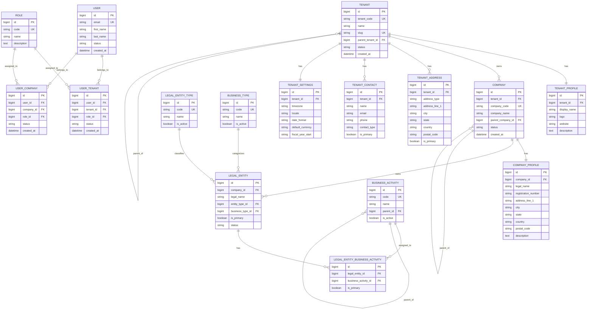

# Tenant and User Multi-Tenancy Model

This model separates the tenant account, the operating company/legal entity, and explicit user membership. It is more suitable for a multi-tenant ERP that will scale beyond a single-company prototype.



## Relationship Summary

| Relationship | Cardinality |
| --- | --- |
| Tenant → TenantProfile | 1 : 1 |
| Tenant → Company | 1 : N |
| Tenant → TenantAddress | 1 : N |
| Tenant → TenantContact | 1 : N |
| Tenant → TenantSettings | 1 : 1 |
| Tenant → Tenant | 1 : N (optional) |
| User → UserTenant | 1 : N |
| User → UserCompany | 1 : N |
| Role → UserTenant | 1 : N |
| Role → UserCompany | 1 : N |
| Company → CompanyProfile | 1 : 1 |
| Company → LegalEntity | 1 : N |
| Company → Company | 1 : N (optional) |
| LegalEntity → LegalEntityType | N : 1 |
| LegalEntity → BusinessType | N : 1 |
| LegalEntity → BusinessActivity | N : M |
| BusinessActivity → BusinessActivity | 1 : N |

## Why this is better

- The tenant is now clearly separated from the operating company.
- A single user can belong to multiple tenants, and a tenant can have many users.
- A user can be assigned different roles across different tenant and company contexts.
- Multi-company and multi-branch operations are easier to model without overloading the tenant table.
- The design is more scalable for SaaS-style operation, where many users belong to many organizations.

## Real Example Data

### TENANT

| id | tenant_code | name | slug | status |
| --- | --- | --- | --- | --- |
| 101 | TEN-1001 | Green Valley Foods | green-valley-foods | active |
| 102 | TEN-1002 | CityCare Health | citycare-health | active |

### TENANT_PROFILE

| id | tenant_id | display_name | website | description |
| --- | --- | --- | --- | --- |
| 1 | 101 | Green Valley Foods Pvt Ltd | https://greenvalleyfoods.example | Grocery and food distribution company |
| 2 | 102 | CityCare Health Services | https://citycare.example | Multi-branch healthcare network |

### COMPANY

| id | tenant_id | company_code | company_name | status |
| --- | --- | --- | --- | --- |
| 201 | 101 | GVF-001 | Green Valley Retail | active |
| 202 | 101 | GVF-002 | Green Valley Distribution | active |
| 203 | 102 | CCH-001 | CityCare Hospitals | active |

### COMPANY_PROFILE

| id | company_id | legal_name | registration_number | city | country |
| --- | --- | --- | --- | --- | --- |
| 1 | 201 | Green Valley Retail Private Limited | REG-1001 | Bengaluru | India |
| 2 | 202 | Green Valley Distribution Private Limited | REG-1002 | Hyderabad | India |
| 3 | 203 | CityCare Hospitals Limited | REG-2001 | Kochi | India |

### USER

| id | email | first_name | last_name | status |
| --- | --- | --- | --- | --- |
| 1 | admin@greenvalleyfoods.example | Arjun | Nair | active |
| 2 | finance@greenvalleyfoods.example | Priya | Menon | active |
| 3 | nurse@citycare.example | Sara | Thomas | active |
| 4 | ops@citycare.example | David | Jacob | active |

### ROLE

| id | code | name | description |
| --- | --- | --- | --- |
| 1 | tenant_admin | Tenant Admin | Full access to tenant-level configuration |
| 2 | company_admin | Company Admin | Full access within a specific company |
| 3 | finance_manager | Finance Manager | Handles accounting, budgets, and invoices |
| 4 | staff_user | Staff User | Limited operations access |

### USER_TENANT

| id | user_id | tenant_id | role_id | status |
| --- | --- | --- | --- | --- |
| 1 | 1 | 101 | 1 | active |
| 2 | 2 | 101 | 3 | active |
| 3 | 3 | 102 | 2 | active |
| 4 | 4 | 102 | 4 | active |

### USER_COMPANY

| id | user_id | company_id | role_id | status |
| --- | --- | --- | --- | --- |
| 1 | 1 | 201 | 2 | active |
| 2 | 1 | 202 | 2 | active |
| 3 | 2 | 201 | 3 | active |
| 4 | 3 | 203 | 2 | active |
| 5 | 4 | 203 | 4 | active |

### LEGAL_ENTITY

| id | company_id | legal_name | is_primary | status |
| --- | --- | --- | --- | --- |
| 1 | 201 | Green Valley Retail Private Limited | true | active |
| 2 | 202 | Green Valley Distribution Private Limited | true | active |
| 3 | 203 | CityCare Hospitals Limited | true | active |

### BUSINESS_TYPE

| id | code | name | is_active |
| --- | --- | --- | --- |
| 1 | RETAIL | Retail | true |
| 2 | DISTRIBUTION | Distribution | true |
| 3 | HEALTHCARE | Healthcare | true |

### BUSINESS_ACTIVITY

| id | code | name | parent_id | is_active |
| --- | --- | --- | --- | --- |
| 1 | GROCERY | Grocery | null | true |
| 2 | PHARMACY | Pharmacy | null | true |
| 3 | HOSPITAL | Hospital | null | true |
| 4 | LAB | Diagnostic Lab | 3 | true |

### LEGAL_ENTITY_BUSINESS_ACTIVITY

| id | legal_entity_id | business_activity_id | is_primary |
| --- | --- | --- | --- |
| 1 | 1 | 1 | true |
| 2 | 2 | 1 | true |
| 3 | 3 | 3 | true |
| 4 | 3 | 4 | false |

## Suggested Initial Structure

```text
Tenant
├── TenantProfile
├── TenantSettings
├── TenantAddress
├── TenantContact
├── Company
│   ├── CompanyProfile
│   ├── LegalEntity
│   │   ├── LegalEntityType
│   │   ├── BusinessType
│   │   └── LegalEntityBusinessActivity
│   │       └── BusinessActivity
│   └── Company hierarchy
└── User membership
    ├── UserTenant
    ├── UserCompany
    └── Role
```

## Notes

- A tenant can own multiple companies and company groups.
- A user belongs to a tenant and may have different permissions across companies.
- The explicit `USER_TENANT` and `USER_COMPANY` tables are important for security and access control.
- This is a better starting point for a larger multi-tenant ERP than storing everything under a single tenant/company model.